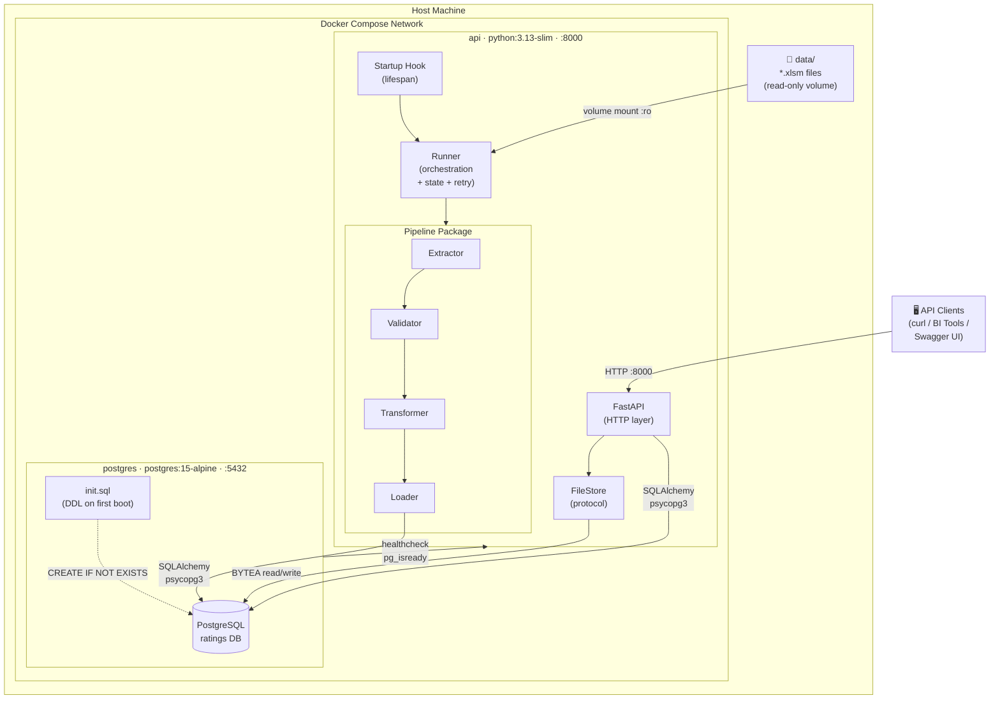
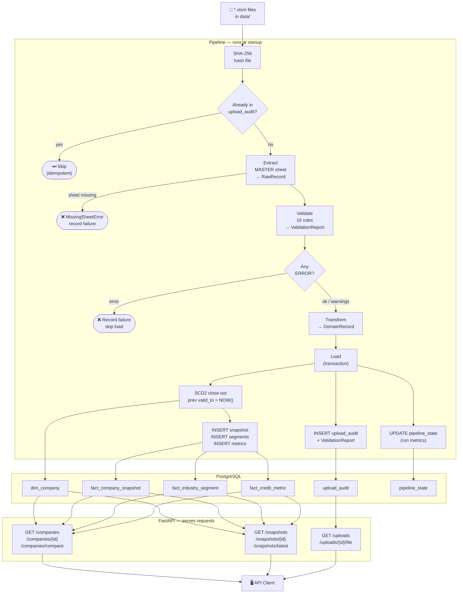
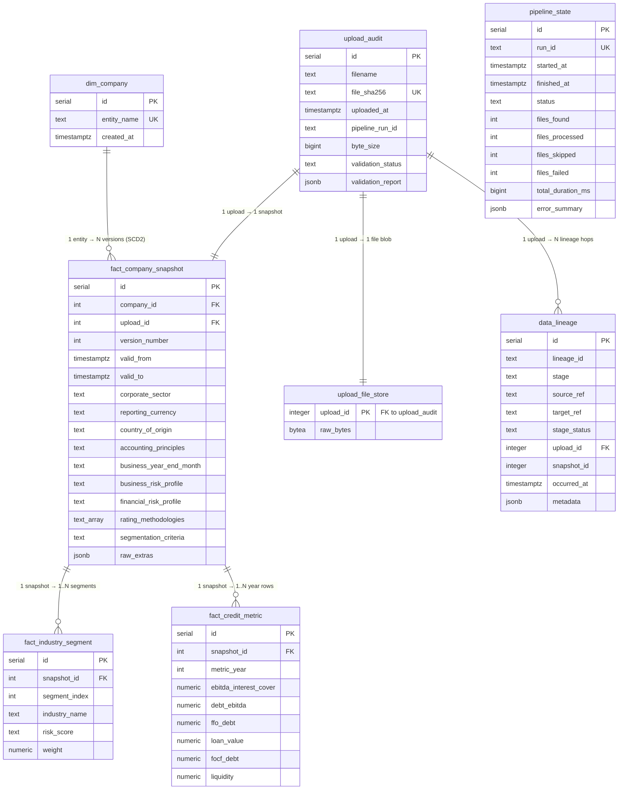
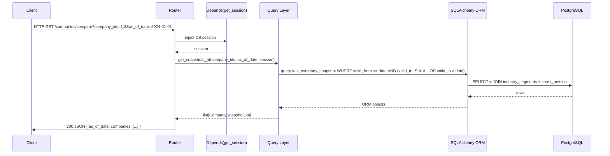
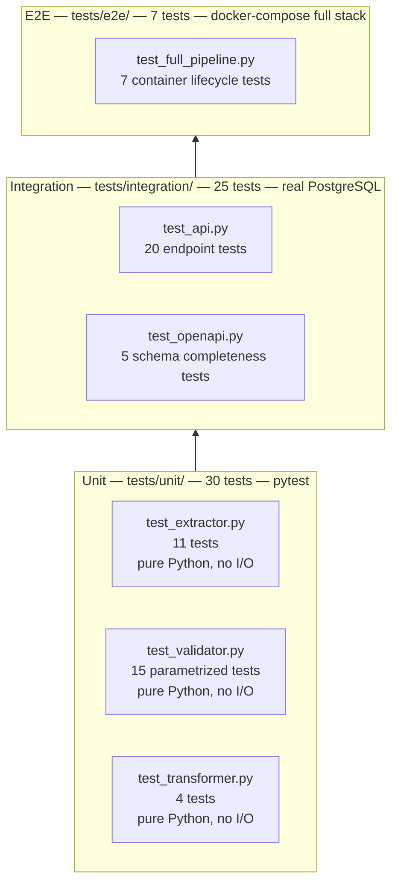

# Implementation Plan: Corporate Credit Rating Data Pipeline

> Based on direct inspection of all four `.xlsm` source files and the full README specification.
> Written: 2026-06-11
> Updated: SOLID & DRY architecture, flake8 linting, full test pyramid (unit / integration / e2e), architectural diagrams, concurrent pipeline (§16)

---

## Tech Stack & Tools

### Runtime

| Layer | Tool | Version | Justification |
|-------|------|---------|---------------|
| Language | Python | 3.13 | Latest stable; `GENERATED ALWAYS AS IDENTITY`, `match` statements, improved typing |
| Web framework | FastAPI | ≥ 0.115 | Native async, automatic OpenAPI generation, Pydantic v2 integration |
| ASGI server | Uvicorn | ≥ 0.30 | Production-grade ASGI; `--workers` flag for multi-process at scale |
| ORM | SQLAlchemy | ≥ 2.0 | Declarative mapping, async support, type-safe queries with `select()` |
| DB driver | psycopg (v3) | ≥ 3.2 | Native Python 3.13 support; replaces legacy psycopg2; async-ready |
| Data validation | Pydantic | ≥ 2.9 | Request/response schemas, settings management, strict mode |
| Settings | pydantic-settings | ≥ 2.5 | Typed env-var loading; single source of truth for config |
| Excel parsing | openpyxl | ≥ 3.1 | Reads `.xlsm` (macro-enabled) without executing VBA; `read_only` mode for speed |
| Database | PostgreSQL | 15-alpine | Declarative partitioning, generated columns (`tsvector`), `CONCURRENTLY` index builds |

### Pipeline & Data

| Tool | Role |
|------|------|
| `hashlib` (stdlib) | SHA-256 file fingerprinting for idempotency |
| `uuid` (stdlib) | `lineage_id` generation per pipeline run |
| `dataclasses` (stdlib) | `RawRecord`, `DomainRecord`, `ValidationReport` — typed, zero-dependency |
| `concurrent.futures` (stdlib) | Future parallel extraction (`ThreadPoolExecutor`); interface ready in `runner.py` |
| `structlog` / `logging` | Structured JSON log output with `run_id`, `file`, `duration_ms` per event |

### Developer Toolchain

| Tool | Version | Role |
|------|---------|------|
| flake8 | ≥ 7.1 | PEP 8 style + error checks; configured in `.flake8` |
| mypy | ≥ 1.11 | Static type checking; `strict = true` in `mypy.ini` |
| black | ≥ 24.0 | Auto-formatter; `max-line-length = 100` |
| isort | ≥ 5.13 | Import ordering; compatible with black |
| pytest | ≥ 8.3 | Test runner for unit, integration, and e2e suites |
| pytest-asyncio | ≥ 0.24 | Async test support for FastAPI endpoints |
| httpx | ≥ 0.27 | Async HTTP client used by FastAPI `TestClient` |
| pytest-cov | ≥ 5.0 | Coverage reporting; `--cov-fail-under=85` enforced in CI |
| pytest-benchmark | ≥ 4.0 | Micro-benchmark suite with regression baseline |
| locust | ≥ 2.28 | HTTP load testing; 3-persona scenario file |

### Infrastructure

| Tool | Version | Role |
|------|---------|------|
| Docker | 24+ | Container runtime |
| Docker Compose | v2 | Multi-service orchestration (`docker-compose.yml`) |
| PostgreSQL image | `postgres:15-alpine` | Lightweight; includes `pg_stat_statements` extension |
| Python image | `python:3.13-slim` | Minimal base image for the API container |

### Non-Goals (tools explicitly excluded)

| Excluded | Reason |
|----------|--------|
| Alembic | Schema managed by `init.sql` mounted at container start; no migration runner needed for this scope |
| Celery / RQ / Temporal | Pipeline runs synchronously at API startup; job queue deferred to scale step §13.1 |
| Redis | No caching or queue layer required |
| Frontend / React | API-only deliverable |
| Cloud SDKs (boto3, azure-storage) | Local deployment only; `FileStore` protocol ready for future swap |
| Authentication (OAuth, JWT) | Explicitly out of scope per README |
| Real-time streaming (Kafka, Faust) | Explicitly out of scope per README |

---

## Table of Contents

0. [Architecture Overview](#0-architecture-overview)
1. [Source Data Analysis](#1-source-data-analysis)
2. [Project Structure](#2-project-structure)
3. [Architecture Principles](#3-architecture-principles)
4. [Data Warehouse Schema](#4-data-warehouse-schema)
5. [Extraction Module](#5-extraction-module)
6. [Validation Framework](#6-validation-framework)
7. [Pipeline Orchestration](#7-pipeline-orchestration)
8. [API Layer](#8-api-layer)
9. [Docker Infrastructure](#9-docker-infrastructure)
10. [Code Quality & Linting](#10-code-quality--linting)
11. [Testing Strategy](#11-testing-strategy)
12. [Performance Tests](#12-performance-tests)
13. [Scale & Production Considerations](#13-scale--production-considerations)
14. [Build Order](#14-build-order)
15. [Deliverables Checklist](#15-deliverables-checklist)
16. [Concurrent Pipeline Architecture](#16-concurrent-pipeline-architecture)

---

## 0. Architecture Overview

Four Mermaid diagrams cover the system from different angles: container topology, end-to-end data flow, database schema, and the API request path. Each diagram is self-contained and can be read independently.

---

### 0.1 System Architecture (Container Level)



---

### 0.2 End-to-End Data Flow (Pipeline + API)



---

### 0.3 Database Schema (Entity-Relationship)



---

### 0.4 API Request Path



---

### 0.5 Test Pyramid



---

## 1. Source Data Analysis

### 1.1 MASTER Sheet Layout (observed, not assumed)

All four files share an identical 178-row × 27-column structure. Only rows 1–40 contain data; rows 41–177 are empty padding. Column 0 is always `None`. The actual content lives in columns 1–N:

```
Row  │ Col 1 (label)                    │ Col 2              │ Col 3
─────┼──────────────────────────────────┼────────────────────┼─────────────────────
  1  │ Rated entity                     │ Company A/B        │
  2  │ CorporateSector                  │ Sector name        │
  4  │ Rating methodologies applied     │ Methodology 1      │ Methodology 2 (opt.)
  6  │ Industry risk                    │ Segment 1          │ Segment 2 (opt.)
  7  │ Industry risk score              │ Score 1            │ Score 2 (opt.)
  8  │ Industry weight                  │ Weight 1 (float)   │ Weight 2 (opt.)
  9  │ Segmentation criteria            │ EBITDA contribution│
 11  │ Reporting Currency/Units         │ EUR / CHF          │
 12  │ Country of origin                │ Country name       │
 13  │ Accounting principles            │ IFRS / GAAP        │
 14  │ End of business year             │ Month name         │
 17  │ Business risk profile            │ Rating (e.g. BBB)  │
 18  │ (Blended) Industry risk profile  │ Rating             │
 19  │ Competitive Positioning          │ Rating             │
 20  │ Market share                     │ Rating             │
 21  │ Diversification                  │ Rating             │
 22  │ Operating profitability          │ Rating             │
 23  │ Sector/company-specific factors  │ Rating             │
 24  │ Sector/company-specific factors  │ Rating (nullable)  │
 26  │ Financial risk profile           │ Rating             │
 27  │ Leverage                         │ Rating             │
 28  │ Interest cover                   │ Rating             │
 29  │ Cash flow cover                  │ Rating             │
 30  │ Liquidity                        │ Notch adj. string  │
 34  │ [Scope Credit Metrics]           │ Year 1 (int)       │ Year 2 (int)
 35  │ Scope-adjusted EBITDA int. cover │ Value Y1           │ Value Y2
 36  │ Scope-adjusted debt/EBITDA       │ Value Y1           │ Value Y2
 37  │ Scope-adjusted FFO/debt          │ Value Y1           │ Value Y2
 38  │ Scope-adjusted loan/value        │ Value Y1           │ Value Y2
 39  │ Scope-adjusted FOCF/debt         │ Value Y1           │ Value Y2
 40  │ Liquidity                        │ Value Y1           │ Value Y2
```

### 1.2 Observed Version Differences

| File        | Entity   | Industry Risk Score | Industry Weights       | FFO/debt |
|-------------|----------|---------------------|------------------------|----------|
| A_1.xlsm    | Company A | A                  | 1.0                    | 27.33    |
| A_2.xlsm    | Company A | BBB                 | 1.0                    | 22.00    |
| B_1.xlsm    | Company B | BBB / BB            | 0.15 / 0.85            | 1 / 2    |
| B_2.xlsm    | Company B | BBB / BB            | **0.25 / 0.75**        | 1 / 1    |

### 1.3 Structural Edge Cases (seen in the data)

| # | Edge Case | Where Seen | Handling Required |
|---|-----------|------------|-------------------|
| EC-1 | Multi-segment industries — same row key, values spread across cols 2..N | B_1, B_2 rows 6-8 | Parse all non-None values right of label |
| EC-2 | Multi-value methodologies — one key, multiple values across cols | A_1 row 4 | Same as EC-1 |
| EC-3 | Nullable optional field | All files row 24 (`Sector/company-specific factors (2)`) | Treat as `None`, do not error |
| EC-4 | Embedded time-series table — row 34 holds year headers, rows 35-40 hold values | All files | Parse row 34 as year keys; zip with metric rows |
| EC-5 | Duplicate label `Liquidity` appears twice (row 30 = notch adj., row 40 = numeric metric) | All files | Distinguish by section (risk profile vs credit metrics) |
| EC-6 | 137 fully-empty trailing rows | All files | Strip by skipping rows where all values are None |
| EC-7 | Liquidity notch is a string ("+1 notch", "-2 notches"), not numeric | All files row 30 | Keep as string in `liquidity_adjustment` field |
| EC-8 | Float vs int weights (0.15 vs 1) both appear | A vs B files | Always cast to `float` |
| EC-9 | MASTER sheet may be absent in future files | Hypothetical | Raise `MissingSheetError`, record in pipeline audit |

---

## 2. Project Structure

```
data_main/
├── docker-compose.yml
├── docker-compose.test.yml             # E2E test override (same images, test data)
├── .env.example                        # Template; .env is gitignored
├── .flake8                             # Flake8 config (max-line-length, ignores)
├── mypy.ini                            # Strict mypy config
├── pyproject.toml                      # black + isort config
├── Makefile                            # lint, format, test-unit, test-integration, test-e2e, ci
├── PLAN.md                             # This file
├── AI_USAGE.md
│
├── data/                               # Source .xlsm files (mounted read-only)
│   ├── corporates_A_1.xlsm
│   ├── corporates_A_2.xlsm
│   ├── corporates_B_1.xlsm
│   └── corporates_B_2.xlsm
│
├── migrations/
│   └── init.sql                        # Full DDL; idempotent (CREATE IF NOT EXISTS)
│
├── api/
│   ├── Dockerfile
│   ├── requirements.txt                # Runtime + dev/test deps
│   ├── main.py                         # FastAPI app, lifespan hook runs pipeline
│   ├── config.py                       # Pydantic Settings from env (single source of truth for env vars)
│   │
│   ├── db/
│   │   └── session.py                  # Engine + session factory (ISP: no models here)
│   │
│   ├── models/
│   │   ├── orm.py                      # SQLAlchemy ORM table definitions (SRP: only schema)
│   │   └── schemas.py                  # Pydantic request/response models (SRP: only serialization)
│   │
│   ├── routers/
│   │   ├── companies.py                # SRP: HTTP handlers only; all SQL via query helpers
│   │   ├── snapshots.py
│   │   └── uploads.py
│   │
│   └── pipeline/
│       ├── extractor.py                # SRP: MASTER sheet → RawRecord; no DB, no validation
│       ├── validator.py                # SRP: RawRecord → ValidationReport; no DB, no parsing
│       ├── transformer.py              # SRP: RawRecord → DomainRecord; no DB, no rules
│       ├── loader.py                   # SRP: DomainRecord → DB; no parsing, no validation
│       ├── runner.py                   # Orchestration: two-pool producer-consumer (§16)
│       ├── worker_cpu.py               # ProcessPoolExecutor worker: hash/extract/validate/transform
│       ├── worker_io.py                # ThreadPoolExecutor worker: lineage write/load/commit
│       ├── protocols.py                # DIP: SheetReader, FileStore, Validator, Loader protocols
│       └── exceptions.py              # Pipeline-specific exception hierarchy
│
├── tests/
│   ├── conftest.py                     # Shared fixtures: DB, TestClient, pipeline seed
│   ├── fixtures/
│   │   └── master_sheet_rows.py        # In-memory row tuples mirroring real xlsm structure
│   ├── unit/
│   │   ├── test_extractor.py           # 11 tests (see §11.2)
│   │   ├── test_validator.py           # 15 parametrized tests
│   │   ├── test_transformer.py         # 4 tests
│   │   ├── test_worker_cpu.py          # 11 tests (see §16.7)
│   │   └── test_worker_io.py           # 13 tests (see §16.7)
│   ├── integration/
│   │   ├── test_api.py                 # 20 endpoint tests against real test DB
│   │   └── test_openapi.py             # 5 OpenAPI completeness tests
│   ├── e2e/
│   │   ├── conftest.py                 # docker-compose up/down session fixture
│   │   └── test_full_pipeline.py       # 7 full-stack tests (see §11.4)
│   └── performance/
│       ├── locustfile.py               # Load test scenarios (3 personas)
│       ├── locust.conf
│       ├── unit/
│       │   ├── test_bench_extractor.py
│       │   ├── test_bench_validator.py
│       │   └── test_bench_transformer.py
│       ├── test_query_plans.py         # EXPLAIN ANALYZE assertions
│       └── results/                    # gitignored — generated per run
│
└── docs/
    ├── api_examples.md                 # 10+ curl examples with real responses
    ├── data_quality_report_example.json
    └── pipeline_execution_log_example.txt
```

---

## 3. Architecture Principles

This section defines the SOLID and DRY rules that govern every module in the codebase. They are stated here so reviewers can flag deviations during code review.

### 3.1 SOLID Application

#### S — Single Responsibility

Each class/module owns exactly one concern. Violations are treated as critical during review.

| Module | Single Responsibility |
|--------|-----------------------|
| `extractor.py` | Parse raw cell values out of the MASTER sheet. No validation, no DB writes. |
| `validator.py` | Apply business rules to a `RawRecord`. No parsing, no DB writes. |
| `transformer.py` | Convert `RawRecord` to typed domain objects. No DB access. |
| `loader.py` | Persist domain objects to the DB. No parsing, no validation. |
| `runner.py` | Orchestrate the pipeline: discover files, call E→V→T→L, manage state, retry. |
| `routers/companies.py` | HTTP handler for company endpoints. No SQL — delegates to a query layer. |
| `db/session.py` | Session factory only. No models, no queries. |

Rule: if a module imports from two non-adjacent pipeline stages it is violating SRP.

#### O — Open/Closed

New behaviour is added by extension, not by modifying existing code.

- **New validation rules** are added by appending to the `RULE_REGISTRY` list in `validator.py`. No existing rule is edited.
- **New file formats** (e.g., `.xlsx` alongside `.xlsm`) are handled by implementing the `SheetReader` protocol and registering it in the reader factory. No changes to `extractor.py`.
- **New API filters** on `/snapshots` are added via the `FilterSet` builder pattern. No changes to existing filter logic.

#### L — Liskov Substitution

The `FileStore` interface (for raw file storage) and the `SheetReader` protocol are the two substitutable abstractions:

```python
class FileStore(Protocol):
    def save(self, key: str, data: bytes) -> None: ...
    def load(self, key: str) -> bytes: ...

class SheetReader(Protocol):
    def read_rows(self, path: str, sheet_name: str) -> list[tuple]: ...
```

`PostgresBytesFileStore` and `LocalSheetReader` are the default implementations. `S3FileStore` and a future `CachedSheetReader` must satisfy the same protocol without the caller knowing the difference.

#### I — Interface Segregation

Clients are not forced to depend on interfaces they don't use.

- `runner.py` receives a `FileStore` for binary storage and a `SessionFactory` for DB access — it does not receive an HTTP client or a file system path.
- `loader.py` receives a `Session` only — it does not receive a `FileStore`.
- API routers receive a `Session` via FastAPI dependency injection — they do not import `runner.py` or `extractor.py`.

#### D — Dependency Inversion

High-level orchestration modules depend on abstractions, not on concrete implementations.

- `runner.py` depends on `SheetReader`, `Validator`, `Transformer`, `Loader` protocols injected at construction. In tests, each can be replaced with a stub without touching `runner.py`.
- FastAPI routers receive the DB session via `Depends(get_session)`. The `get_session` function is swapped in tests to point at the test DB.

```python
# Concrete wiring lives in main.py (composition root), not inside any module
def build_runner(session_factory) -> PipelineRunner:
    return PipelineRunner(
        reader=LocalSheetReader(),
        validator=RuleSetValidator(RULE_REGISTRY),
        transformer=DomainTransformer(),
        loader=DBLoader(session_factory),
        file_store=PostgresBytesFileStore(session_factory),
    )
```

### 3.2 DRY Application

Every piece of knowledge has a single authoritative location.

| Knowledge | Single Location | Used By |
|-----------|-----------------|---------|
| Label-to-field mapping | `extractor.LABEL_ALIASES` dict | extractor, tests |
| Validation rules | `validator.RULE_REGISTRY` | validator, test parametrize |
| DB column names | `models/orm.py` | loader, routers, tests (via ORM) |
| Credit rating regex | `validator.RATING_PATTERN` constant | R13 rule, tests |
| Month name list | `transformer.VALID_MONTHS` constant | R09 rule, transformer |
| Pagination defaults | `config.DEFAULT_PAGE_SIZE`, `config.MAX_PAGE_SIZE` | all list endpoints |
| SCD2 close-out SQL | `loader.close_open_snapshot()` helper | loader only — never copy-pasted |
| Docker env var names | `.env.example` → `config.py` (Pydantic Settings) | docker-compose, api, tests |

Rule: if the same string literal or magic number appears in more than one file, it is a DRY violation and must be extracted to a constant.

### 3.3 Composition over Inheritance

No deep class hierarchies. The pipeline stages communicate through dataclasses (`RawRecord`, `DomainRecord`, `ValidationReport`). Behaviour is composed via protocols, not base classes. The only place inheritance is acceptable is FastAPI's `HTTPException` subclasses for domain-specific error types.

### 3.4 Design Patterns

Five patterns are selected because each solves a concrete structural problem in this codebase. They compose cleanly — the same object can be a Repository target (pattern 2) reached via a Unit of Work (pattern 5) whose loader uses a Strategy (pattern 3) and calls a Rules Engine (pattern 4), all wired together by a Chain of Responsibility (pattern 1).

---

#### Pattern 1 — Chain of Responsibility (ETL Pipeline Stages)

**Problem:** The four pipeline stages (Extract → Validate → Transform → Load) must be independent and individually replaceable, but they share state and must be able to short-circuit on failure without coupling to each other.

**Solution:** Each stage is a `Handler` that receives a `PipelineContext`, does its work, and either forwards to the next handler or raises to stop the chain.

```python
# protocols.py
class PipelineHandler(Protocol):
    def handle(self, ctx: PipelineContext) -> PipelineContext: ...

# pipeline/runner.py
class PipelineRunner:
    def __init__(self, handlers: list[PipelineHandler]) -> None:
        self._handlers = handlers

    def run(self, ctx: PipelineContext) -> PipelineContext:
        for handler in self._handlers:
            ctx = handler.handle(ctx)
        return ctx

# wiring (composition root / main.py)
runner = PipelineRunner([
    ExtractHandler(sheet_reader),
    ValidateHandler(rule_registry),
    TransformHandler(),
    LoadHandler(unit_of_work),
])
```

**Why chosen:** Keeps each stage testable in isolation with a fake context; adding a new stage requires zero changes to existing handlers — satisfies OCP.

---

#### Pattern 2 — Repository (Data Access Layer)

**Problem:** Routers and pipeline loaders should not know whether data comes from PostgreSQL, an in-memory fixture, or a future data lake.

**Solution:** Abstract each aggregate root behind a repository interface. Concrete implementations hide all SQL. Tests inject fakes.

```python
# protocols.py
class CompanyRepository(Protocol):
    def get_by_name(self, name: str) -> Company | None: ...
    def upsert(self, company: Company) -> Company: ...

class SnapshotRepository(Protocol):
    def get_current(self, company_id: int) -> Snapshot | None: ...
    def get_at(self, company_id: int, as_of: date) -> Snapshot | None: ...
    def list_versions(self, company_id: int) -> list[Snapshot]: ...
    def insert(self, snapshot: Snapshot) -> Snapshot: ...

# storage/pg_company_repo.py
class PgCompanyRepository:
    def __init__(self, session: Session) -> None:
        self._session = session

    def upsert(self, company: Company) -> Company:
        existing = (
            self._session.query(DimCompany)
            .filter(func.lower(DimCompany.entity_name) == company.name.lower())
            .one_or_none()
        )
        if existing:
            return _to_domain(existing)
        row = DimCompany(entity_name=company.name)
        self._session.add(row)
        self._session.flush()
        return _to_domain(row)
```

**Why chosen:** Decouples the API layer from the ORM; any router test can use `FakeSnapshotRepository` without a database. Matches ISP — each repository exposes only the methods its consumers need.

---

#### Pattern 3 — Strategy (Pluggable Readers and File Stores)

**Problem:** In development the pipeline reads local `.xlsm` files; in production the same files might arrive via S3. The file storage backend must be swappable without changing pipeline logic.

**Solution:** Define narrow protocols for each behaviour. The pipeline depends only on the protocol; concrete strategies are injected at the composition root.

```python
# protocols.py
class SheetReader(Protocol):
    def read_master(self, source: str | Path) -> DataFrame: ...

class FileStore(Protocol):
    def save(self, filename: str, data: bytes) -> str: ...
    def load(self, key: str) -> bytes: ...

# Default strategies (used in production Docker Compose)
class LocalSheetReader:
    def read_master(self, source: str | Path) -> DataFrame:
        return pd.read_excel(source, sheet_name="MASTER", header=None)

class PostgresBytesFileStore:
    def __init__(self, session: Session) -> None: ...
    def save(self, filename: str, data: bytes) -> str:
        row = UploadFileStore(filename=filename, raw_bytes=data)
        self._session.add(row)
        self._session.flush()
        return str(row.file_store_id)

# Future drop-in (requires no changes to ExtractHandler)
class S3FileStore:
    def save(self, filename: str, data: bytes) -> str: ...
```

**Why chosen:** Adding `S3FileStore` is a zero-change swap. Satisfies OCP and DIP. In tests, `FakeFileStore` stores bytes in a dict.

---

#### Pattern 4 — Specification / Rules Engine (Validation)

**Problem:** The 16 validation rules (R01–R16) must each be independently testable, combinable, and registerable without modifying the `Validator` class itself.

**Solution:** Each rule is a callable `(record: DomainRecord) -> ValidationResult`. A central `RULE_REGISTRY` list is the single authoritative source.

```python
# validation/rules.py
@dataclass
class ValidationResult:
    passed: bool
    rule_id: str
    severity: Literal["ERROR", "WARNING"]
    message: str

RuleFn = Callable[[DomainRecord], ValidationResult]

def r01_required_fields(record: DomainRecord) -> ValidationResult:
    missing = [f for f in REQUIRED_FIELDS if not getattr(record, f, None)]
    return ValidationResult(
        passed=not missing,
        rule_id="R01",
        severity="ERROR",
        message=f"Missing required fields: {missing}" if missing else "OK",
    )

def r04_weights_sum_to_one(record: DomainRecord) -> ValidationResult:
    total = sum(s.weight for s in record.industry_segments)
    ok = abs(total - 1.0) < 1e-6
    return ValidationResult(passed=ok, rule_id="R04", severity="ERROR",
                            message=f"Weights sum to {total:.6f}, expected 1.0")

# Single registration point (DRY — rule added here, nowhere else)
RULE_REGISTRY: list[RuleFn] = [
    r01_required_fields,
    r02_entity_name_non_empty,
    r03_score_in_valid_range,
    r04_weights_sum_to_one,
    # ... R05–R16
]

class Validator:
    def __init__(self, registry: list[RuleFn] = RULE_REGISTRY) -> None:
        self._registry = registry

    def validate(self, record: DomainRecord) -> ValidationReport:
        results = [rule(record) for rule in self._registry]
        return ValidationReport(results=results)
```

**Why chosen:** Each rule is a pure function — trivially unit-testable. `RULE_REGISTRY` is the DRY authoritative list. New rules require zero changes to `Validator` (OCP).

---

#### Pattern 5 — Unit of Work (Transaction Scope in Loader)

**Problem:** Loading one Excel file touches seven tables atomically. A partial write must never persist.

**Solution:** The `UnitOfWork` owns the session and exposes repositories as properties. The `LoadHandler` calls `uow.commit()` only after all repositories have flushed successfully.

```python
# storage/unit_of_work.py
class UnitOfWork:
    def __init__(self, session_factory: sessionmaker) -> None:
        self._factory = session_factory

    def __enter__(self) -> "UnitOfWork":
        self._session = self._factory()
        self.companies = PgCompanyRepository(self._session)
        self.snapshots = PgSnapshotRepository(self._session)
        self.uploads = PgUploadRepository(self._session)
        self.lineage = PgLineageRepository(self._session)
        return self

    def __exit__(self, exc_type, exc_val, exc_tb) -> None:
        if exc_type:
            self._session.rollback()
        self._session.close()

    def commit(self) -> None:
        self._session.commit()

# pipeline/load_handler.py
class LoadHandler:
    def handle(self, ctx: PipelineContext) -> PipelineContext:
        with self._uow as uow:
            company = uow.companies.upsert(ctx.domain_record.company)
            upload = uow.uploads.insert(ctx.upload_meta)
            snapshot = uow.snapshots.insert(
                ctx.domain_record.snapshot._replace(company_id=company.id,
                                                     upload_id=upload.id)
            )
            uow.lineage.record(ctx.lineage_id, stage="loaded", entity_id=snapshot.id)
            uow.commit()
        ctx.snapshot_id = snapshot.id
        return ctx
```

**Why chosen:** Any exception in the `with` block triggers an automatic rollback. Test fakes implement `FakeUnitOfWork` with in-memory dicts and a `committed` flag.

---

#### Pattern Summary

| # | Pattern | Applied To | Key Benefit |
|---|---------|-----------|-------------|
| 1 | Chain of Responsibility | `PipelineRunner` → handlers | Stages independently replaceable; short-circuit on failure |
| 2 | Repository | `CompanyRepository`, `SnapshotRepository`, `UploadRepository`, `LineageRepository` | Decouples routers and loaders from SQLAlchemy session |
| 3 | Strategy | `SheetReader`, `FileStore` protocols + concrete implementations | Backend swap with zero changes to pipeline logic |
| 4 | Specification / Rules Engine | `RULE_REGISTRY` + `RuleFn` callables (R01–R16) | Each rule pure-function testable; new rules = one list append |
| 5 | Unit of Work | `UnitOfWork` context manager in `LoadHandler` | All 7 table writes commit or rollback atomically |

---

## 4. Data Warehouse Schema

### 4.1 Design Principles

- **Star schema** with one fact table per granularity level.
- **SCD Type 2** on `fact_company_snapshot` — every upload creates a new row; `valid_to = NULL` marks the current record. No in-place updates to historical rows.
- **Idempotency** enforced by a unique constraint on `(file_sha256)` in `upload_audit`, and application-layer pre-insert SELECT check in `fact_company_snapshot` (required by partitioned table constraints).
- **Industry segments** stored in a child table to avoid `industry_risk_1`/`industry_risk_2` anti-pattern — supports N segments.
- **Credit metrics time-series** stored in a dedicated child table — each metric×year is one row.
- **Raw file bytes isolated** in `upload_file_store` — separate from `upload_audit` so list queries never touch large TOAST data.
- **Every index is justified by a specific named query** — no speculative indexes (they slow writes and bloat storage).
- **Three index techniques in use**: B-tree (point lookups, range, sort), GIN (array containment, trigram fuzzy search, tsvector full-text), BRIN (monotonic timestamp range scans).
- **Two materialized views**: `mv_current_snapshots` (current-record join) and `mv_analytics_summary` (pre-aggregated sector/currency/country stats) — both refreshed after each pipeline run.

### 4.2 Query-to-Index Mapping

**Point-lookup & range indexes (B-tree)**

| Index | Table | Query pattern | Endpoint(s) |
|-------|-------|---------------|-------------|
| `(company_id) WHERE valid_to IS NULL` UNIQUE | snapshot | "get current record for company X" | `GET /companies/{id}`, `/snapshots/latest` |
| `(company_id, valid_from DESC) INCLUDE (...)` covering | snapshot | list + sort all versions; index-only scan | `GET /companies`, `/companies/{id}/versions` |
| `(company_id, valid_from, valid_to)` | snapshot | point-in-time range: `valid_from <= D AND valid_to > D` | `GET /companies/compare` |
| `(corporate_sector) WHERE valid_to IS NULL` | snapshot | equality filter on current records | `GET /snapshots?sector=X` |
| `(country_of_origin) WHERE valid_to IS NULL` | snapshot | equality filter on current records | `GET /snapshots?country=X` |
| `(reporting_currency) WHERE valid_to IS NULL` | snapshot | equality filter on current records | `GET /snapshots?currency=X` |
| BRIN on `valid_from` | snapshot | time-range scan on monotonic timestamps | `GET /snapshots?from_date=X&to_date=Y` |
| `(snapshot_id, metric_year)` | credit_metric | JOIN + ORDER BY year | `GET /companies/{id}/history` |
| `(snapshot_id, segment_index)` | industry_segment | JOIN from snapshot | all snapshot detail endpoints |
| `(uploaded_at DESC)` | upload_audit | paginated list ordered by recency | `GET /uploads` |
| `LOWER(entity_name)` expression | dim_company | case-insensitive lookup at upsert time | pipeline loader |

**Analytics & aggregation indexes**

| Index | Table | Query pattern | Endpoint(s) |
|-------|-------|---------------|-------------|
| `(corporate_sector, reporting_currency, country_of_origin)` WHERE valid_to IS NULL | snapshot | multi-dimension GROUP BY for stats | `GET /uploads/stats`, analytics |
| `(metric_year) INCLUDE (ffo_debt, debt_ebitda, ebitda_interest_cover)` covering | credit_metric | GROUP BY year + AVG/MIN/MAX on metrics | time-series analytics |

**Fuzzy search & full-text indexes (GIN)**

| Index | Table | Query pattern |
|-------|-------|---------------|
| GIN `gin_trgm_ops` on `entity_name` | dim_company | `entity_name ILIKE '%acme%'` / similarity search |
| GIN `gin_trgm_ops` on `corporate_sector` | snapshot | fuzzy sector filter `sector % 'automob'` |
| GIN on `search_vector` (generated tsvector) | snapshot | `search_vector @@ to_tsquery('english', 'consumer & goods')` |
| GIN on `rating_methodologies` | snapshot | `'X' = ANY(rating_methodologies)` array containment |

### 4.3 Full DDL

```sql
-- ═══════════════════════════════════════════════════════════════
-- EXTENSIONS
-- ═══════════════════════════════════════════════════════════════
CREATE EXTENSION IF NOT EXISTS pg_stat_statements;  -- slow-query monitoring
CREATE EXTENSION IF NOT EXISTS pg_trgm;             -- fuzzy name search

-- ═══════════════════════════════════════════════════════════════
-- dim_company
-- One row per legal entity. Natural key = entity_name (normalized).
-- ═══════════════════════════════════════════════════════════════
CREATE TABLE IF NOT EXISTS dim_company (
    id          INTEGER GENERATED ALWAYS AS IDENTITY PRIMARY KEY,
    entity_name TEXT    NOT NULL,
    created_at  TIMESTAMPTZ NOT NULL DEFAULT NOW(),
    CONSTRAINT  uq_company_name UNIQUE (entity_name)
);

CREATE UNIQUE INDEX IF NOT EXISTS idx_company_name_lower
    ON dim_company (LOWER(entity_name));

-- ═══════════════════════════════════════════════════════════════
-- upload_audit
-- One row per processed file. Metadata only — no raw bytes here.
-- Raw bytes live in upload_file_store to keep this table narrow.
-- ═══════════════════════════════════════════════════════════════
CREATE TABLE IF NOT EXISTS upload_audit (
    id                INTEGER GENERATED ALWAYS AS IDENTITY PRIMARY KEY,
    filename          TEXT        NOT NULL,
    file_sha256       TEXT        NOT NULL,
    uploaded_at       TIMESTAMPTZ NOT NULL DEFAULT NOW(),
    pipeline_run_id   TEXT        NOT NULL,
    byte_size         BIGINT,
    validation_status TEXT        NOT NULL
        CHECK (validation_status IN ('passed', 'passed_with_warnings', 'failed')),
    validation_report JSONB,
    CONSTRAINT uq_upload_sha256 UNIQUE (file_sha256)
);

CREATE INDEX IF NOT EXISTS idx_upload_uploaded_at
    ON upload_audit (uploaded_at DESC);

CREATE INDEX IF NOT EXISTS idx_upload_pipeline_run
    ON upload_audit (pipeline_run_id);

-- ═══════════════════════════════════════════════════════════════
-- upload_file_store
-- Isolated raw bytes. Joined only when /uploads/{id}/file is called.
-- ═══════════════════════════════════════════════════════════════
CREATE TABLE IF NOT EXISTS upload_file_store (
    upload_id   INTEGER PRIMARY KEY REFERENCES upload_audit(id) ON DELETE CASCADE,
    raw_bytes   BYTEA NOT NULL
);

-- ═══════════════════════════════════════════════════════════════
-- fact_company_snapshot
-- One row per (company, upload). SCD Type 2: valid_to=NULL is current.
--
-- PARTITIONING: declarative RANGE partition by valid_from (annual).
-- README evaluation criteria explicitly calls out indexing AND
-- partitioning. Each partition is independently vacuumed and its
-- indexes are smaller, making point-in-time range scans faster.
--
-- FILLFACTOR=80 on each partition: HOT updates to valid_to (SCD2
-- close-out) need free page space to avoid index churn.
--
-- UNIQUE constraint note: PostgreSQL requires the partition key
-- (valid_from) to be included in any UNIQUE constraint on a
-- partitioned table. The idempotency guarantee (one snapshot per
-- upload+company) is enforced at the application layer in loader.py
-- with a pre-insert SELECT check, not a DB UNIQUE.
-- ═══════════════════════════════════════════════════════════════
CREATE TABLE IF NOT EXISTS fact_company_snapshot (
    id                          INTEGER GENERATED ALWAYS AS IDENTITY,
    company_id                  INTEGER     NOT NULL REFERENCES dim_company(id),
    upload_id                   INTEGER     NOT NULL REFERENCES upload_audit(id),
    version_number              INTEGER     NOT NULL,

    valid_from                  TIMESTAMPTZ NOT NULL,
    valid_to                    TIMESTAMPTZ,

    corporate_sector            TEXT,
    reporting_currency          TEXT,
    country_of_origin           TEXT,
    accounting_principles       TEXT,
    business_year_end_month     TEXT,
    segmentation_criteria       TEXT,

    business_risk_profile       TEXT,
    blended_industry_risk_profile TEXT,
    competitive_positioning     TEXT,
    market_share                TEXT,
    diversification             TEXT,
    operating_profitability     TEXT,
    sector_specific_factor_1    TEXT,
    sector_specific_factor_2    TEXT,
    financial_risk_profile      TEXT,
    leverage                    TEXT,
    interest_cover              TEXT,
    cash_flow_cover             TEXT,
    liquidity_adjustment        TEXT,

    rating_methodologies        TEXT[],
    raw_extras                  JSONB,

    PRIMARY KEY (id, valid_from)
    -- NOTE: no WITH (fillfactor=80) here — storage parameters are not
    -- supported on the partitioned parent; set per-partition below.
) PARTITION BY RANGE (valid_from);

-- Annual partitions covering the data range in the provided files.
-- fillfactor=80 is set here (on each leaf partition), not on the parent.
-- HOT updates to valid_to (SCD2 close-out) need free page space.
CREATE TABLE IF NOT EXISTS fcs_2018
    PARTITION OF fact_company_snapshot
    FOR VALUES FROM ('2018-01-01') TO ('2019-01-01')
    WITH (fillfactor = 80);

CREATE TABLE IF NOT EXISTS fcs_2019
    PARTITION OF fact_company_snapshot
    FOR VALUES FROM ('2019-01-01') TO ('2020-01-01')
    WITH (fillfactor = 80);

CREATE TABLE IF NOT EXISTS fcs_2020
    PARTITION OF fact_company_snapshot
    FOR VALUES FROM ('2020-01-01') TO ('2021-01-01')
    WITH (fillfactor = 80);

CREATE TABLE IF NOT EXISTS fcs_2021
    PARTITION OF fact_company_snapshot
    FOR VALUES FROM ('2021-01-01') TO ('2022-01-01')
    WITH (fillfactor = 80);

CREATE TABLE IF NOT EXISTS fcs_default
    PARTITION OF fact_company_snapshot DEFAULT
    WITH (fillfactor = 80);

-- HOT PATH: "current snapshot for company X"
-- NOTE: PostgreSQL requires unique indexes on partitioned tables to include
-- the partition key (valid_from). A UNIQUE index on (company_id) alone is
-- therefore invalid. The one-open-row-per-company invariant is enforced at
-- the application layer in loader.py (pre-insert SELECT check) instead.
CREATE INDEX IF NOT EXISTS idx_snapshot_current_by_company
    ON fact_company_snapshot (company_id)
    WHERE valid_to IS NULL;

-- HOT PATH: list + version history (covering index for index-only scan)
CREATE INDEX IF NOT EXISTS idx_snapshot_versions_covering
    ON fact_company_snapshot (company_id, valid_from DESC)
    INCLUDE (version_number, corporate_sector, reporting_currency,
             country_of_origin, business_risk_profile, financial_risk_profile,
             blended_industry_risk_profile, valid_to);

-- POINT-IN-TIME: GET /companies/compare
CREATE INDEX IF NOT EXISTS idx_snapshot_point_in_time
    ON fact_company_snapshot (company_id, valid_from, valid_to);

-- FILTER: GET /snapshots?sector / country / currency
CREATE INDEX IF NOT EXISTS idx_snapshot_sector_current
    ON fact_company_snapshot (corporate_sector)
    WHERE valid_to IS NULL;

CREATE INDEX IF NOT EXISTS idx_snapshot_country_current
    ON fact_company_snapshot (country_of_origin)
    WHERE valid_to IS NULL;

CREATE INDEX IF NOT EXISTS idx_snapshot_currency_current
    ON fact_company_snapshot (reporting_currency)
    WHERE valid_to IS NULL;

-- TIME-RANGE: GET /snapshots?from_date=X&to_date=Y
CREATE INDEX IF NOT EXISTS idx_snapshot_valid_from_brin
    ON fact_company_snapshot USING BRIN (valid_from);

-- ARRAY SEARCH: future filter by methodology
CREATE INDEX IF NOT EXISTS idx_snapshot_methodologies_gin
    ON fact_company_snapshot USING GIN (rating_methodologies);

-- ═══════════════════════════════════════════════════════════════
-- fact_industry_segment
-- 1..N rows per snapshot.
-- ═══════════════════════════════════════════════════════════════
CREATE TABLE IF NOT EXISTS fact_industry_segment (
    id              INTEGER GENERATED ALWAYS AS IDENTITY PRIMARY KEY,
    -- FK to fact_company_snapshot omitted: PostgreSQL cannot enforce a FK
    -- to a partitioned table whose PK is (id, valid_from) using id alone.
    -- Referential integrity is enforced in loader.py (Unit of Work).
    snapshot_id     INTEGER     NOT NULL,
    segment_index   SMALLINT    NOT NULL,
    industry_name   TEXT        NOT NULL,
    risk_score      TEXT        NOT NULL,
    weight          NUMERIC(6,4) NOT NULL,
    CONSTRAINT uq_segment_snapshot_idx UNIQUE (snapshot_id, segment_index)
);

CREATE INDEX IF NOT EXISTS idx_segment_snapshot_id
    ON fact_industry_segment (snapshot_id);

-- ═══════════════════════════════════════════════════════════════
-- fact_credit_metric
-- 1..N rows per snapshot (one per year).
-- DOUBLE PRECISION: analytical ratios, not monetary amounts.
-- ═══════════════════════════════════════════════════════════════
CREATE TABLE IF NOT EXISTS fact_credit_metric (
    id                    INTEGER GENERATED ALWAYS AS IDENTITY PRIMARY KEY,
    -- FK to fact_company_snapshot omitted for the same reason as
    -- fact_industry_segment (partitioned PK constraint). Enforced in loader.py.
    snapshot_id           INTEGER     NOT NULL,
    metric_year           SMALLINT    NOT NULL,
    ebitda_interest_cover DOUBLE PRECISION,
    debt_ebitda           DOUBLE PRECISION,
    ffo_debt              DOUBLE PRECISION,
    loan_value            DOUBLE PRECISION,
    focf_debt             DOUBLE PRECISION,
    liquidity             DOUBLE PRECISION,
    CONSTRAINT uq_metric_snapshot_year UNIQUE (snapshot_id, metric_year)
);

-- ═══════════════════════════════════════════════════════════════
-- data_lineage
-- One row per pipeline stage per file. The lineage_id UUID ties all
-- four hops (source → extracted → validated → loaded) for a single
-- file into one traceable chain.
-- ═══════════════════════════════════════════════════════════════
CREATE TABLE IF NOT EXISTS data_lineage (
    id              INTEGER GENERATED ALWAYS AS IDENTITY PRIMARY KEY,
    lineage_id      TEXT        NOT NULL,
    stage           TEXT        NOT NULL
        CHECK (stage IN ('source', 'extracted', 'validated', 'loaded')),
    source_ref      TEXT        NOT NULL,
    target_ref      TEXT,
    stage_status    TEXT        NOT NULL
        CHECK (stage_status IN ('success', 'failed', 'skipped')),
    upload_id       INTEGER     REFERENCES upload_audit(id),
    snapshot_id     INTEGER,
    occurred_at     TIMESTAMPTZ NOT NULL DEFAULT NOW(),
    metadata        JSONB
);

CREATE INDEX IF NOT EXISTS idx_lineage_lineage_id
    ON data_lineage (lineage_id);

CREATE INDEX IF NOT EXISTS idx_lineage_upload_id
    ON data_lineage (upload_id);

-- ═══════════════════════════════════════════════════════════════
-- pipeline_state
-- One row per pipeline run.
-- ═══════════════════════════════════════════════════════════════
CREATE TABLE IF NOT EXISTS pipeline_state (
    id                INTEGER GENERATED ALWAYS AS IDENTITY PRIMARY KEY,
    run_id            TEXT    NOT NULL,
    started_at        TIMESTAMPTZ NOT NULL,
    finished_at       TIMESTAMPTZ,
    status            TEXT    NOT NULL
        CHECK (status IN ('running', 'success', 'partial', 'failed')),
    files_found       INTEGER,
    files_processed   INTEGER,
    files_skipped     INTEGER,
    files_failed      INTEGER,
    total_duration_ms BIGINT,
    error_summary     JSONB,
    CONSTRAINT uq_pipeline_run_id UNIQUE (run_id)
);

-- ═══════════════════════════════════════════════════════════════
-- mv_current_snapshots   (MATERIALIZED VIEW)
-- Pre-joined current state of every company. Refreshed by the pipeline
-- runner after each successful run.
-- ═══════════════════════════════════════════════════════════════
CREATE MATERIALIZED VIEW IF NOT EXISTS mv_current_snapshots AS
    SELECT
        s.id                            AS snapshot_id,
        c.id                            AS company_id,
        c.entity_name,
        s.version_number,
        s.valid_from,
        s.corporate_sector,
        s.reporting_currency,
        s.country_of_origin,
        s.accounting_principles,
        s.business_year_end_month,
        s.business_risk_profile,
        s.blended_industry_risk_profile,
        s.financial_risk_profile,
        s.competitive_positioning,
        s.market_share,
        s.diversification,
        s.operating_profitability,
        s.leverage,
        s.interest_cover,
        s.cash_flow_cover,
        s.liquidity_adjustment,
        s.rating_methodologies,
        s.segmentation_criteria
    FROM fact_company_snapshot s
    JOIN dim_company c ON c.id = s.company_id
    WHERE s.valid_to IS NULL
WITH DATA;

CREATE UNIQUE INDEX IF NOT EXISTS idx_mv_current_company_id
    ON mv_current_snapshots (company_id);

CREATE INDEX IF NOT EXISTS idx_mv_current_sector
    ON mv_current_snapshots (corporate_sector);

CREATE INDEX IF NOT EXISTS idx_mv_current_country
    ON mv_current_snapshots (country_of_origin);

CREATE INDEX IF NOT EXISTS idx_mv_current_currency
    ON mv_current_snapshots (reporting_currency);

-- Refresh command executed by pipeline runner after successful load:
-- REFRESH MATERIALIZED VIEW CONCURRENTLY mv_current_snapshots;
-- CONCURRENTLY avoids an exclusive lock; reads are served during refresh.

-- ═══════════════════════════════════════════════════════════════
-- ANALYTICS: trigram fuzzy search
-- ═══════════════════════════════════════════════════════════════
CREATE INDEX IF NOT EXISTS idx_company_name_trgm
    ON dim_company USING GIN (entity_name gin_trgm_ops);

CREATE INDEX IF NOT EXISTS idx_snapshot_sector_trgm
    ON fact_company_snapshot USING GIN (corporate_sector gin_trgm_ops);

-- ═══════════════════════════════════════════════════════════════
-- ANALYTICS: full-text search vector (generated column, stored)
-- ═══════════════════════════════════════════════════════════════
ALTER TABLE fact_company_snapshot
    ADD COLUMN IF NOT EXISTS search_vector TSVECTOR
    GENERATED ALWAYS AS (
        to_tsvector('english',
            COALESCE(corporate_sector,             '') || ' ' ||
            COALESCE(country_of_origin,            '') || ' ' ||
            COALESCE(business_risk_profile,        '') || ' ' ||
            COALESCE(financial_risk_profile,       '') || ' ' ||
            COALESCE(blended_industry_risk_profile,'')
        )
    ) STORED;

CREATE INDEX IF NOT EXISTS idx_snapshot_search_fts
    ON fact_company_snapshot USING GIN (search_vector);

-- ═══════════════════════════════════════════════════════════════
-- ANALYTICS: covering index for GROUP BY / aggregation queries
-- ═══════════════════════════════════════════════════════════════
CREATE INDEX IF NOT EXISTS idx_snapshot_analytics_dimensions
    ON fact_company_snapshot (corporate_sector, reporting_currency, country_of_origin)
    INCLUDE (version_number, business_risk_profile, financial_risk_profile, valid_from)
    WHERE valid_to IS NULL;

-- ═══════════════════════════════════════════════════════════════
-- ANALYTICS: covering index for time-series metric aggregations
-- ═══════════════════════════════════════════════════════════════
CREATE INDEX IF NOT EXISTS idx_credit_metric_analytics
    ON fact_credit_metric (metric_year)
    INCLUDE (snapshot_id, ffo_debt, debt_ebitda, ebitda_interest_cover, focf_debt);

-- ═══════════════════════════════════════════════════════════════
-- mv_analytics_summary   (MATERIALIZED VIEW)
-- Pre-aggregated stats by sector, currency, and country.
-- ═══════════════════════════════════════════════════════════════
CREATE MATERIALIZED VIEW IF NOT EXISTS mv_analytics_summary AS
    SELECT
        s.corporate_sector,
        s.reporting_currency,
        s.country_of_origin,
        COUNT(*)                          AS company_count,
        AVG(cm.ffo_debt)                  AS avg_ffo_debt,
        AVG(cm.debt_ebitda)               AS avg_debt_ebitda,
        AVG(cm.ebitda_interest_cover)     AS avg_ebitda_cover,
        MIN(cm.metric_year)               AS earliest_year,
        MAX(cm.metric_year)               AS latest_year
    FROM mv_current_snapshots s
    JOIN fact_credit_metric cm
      ON cm.snapshot_id = s.snapshot_id
    GROUP BY
        s.corporate_sector,
        s.reporting_currency,
        s.country_of_origin
WITH DATA;

CREATE UNIQUE INDEX IF NOT EXISTS idx_mv_analytics_dims
    ON mv_analytics_summary (corporate_sector, reporting_currency, country_of_origin);

-- Refresh both views after pipeline run (order matters: summary depends on current):
-- REFRESH MATERIALIZED VIEW CONCURRENTLY mv_current_snapshots;
-- REFRESH MATERIALIZED VIEW CONCURRENTLY mv_analytics_summary;
```

### 4.4 PostgreSQL Configuration Tuning

```ini
# Memory
work_mem                = 16MB
shared_buffers          = 256MB
effective_cache_size    = 768MB

# Write performance for pipeline ingestion
synchronous_commit      = off

# Autovacuum — aggressive for fact_company_snapshot (HOT update on valid_to)
autovacuum_vacuum_scale_factor  = 0.01
autovacuum_analyze_scale_factor = 0.005

# Query planner
random_page_cost        = 1.1
effective_io_concurrency = 200
```

Set in `docker-compose.yml` via the `command` key:
```yaml
postgres:
  image: postgres:15-alpine
  command: >
    postgres
      -c work_mem=16MB
      -c shared_buffers=256MB
      -c effective_cache_size=768MB
      -c synchronous_commit=off
      -c random_page_cost=1.1
      -c effective_io_concurrency=200
      -c autovacuum_vacuum_scale_factor=0.01
      -c autovacuum_analyze_scale_factor=0.005
```

### 4.5 SQLAlchemy Connection Pool

```python
engine = create_engine(
    settings.database_url,
    pool_size=10,
    max_overflow=20,
    pool_timeout=30,
    pool_recycle=3600,
    pool_pre_ping=True,
    connect_args={"options": "-c statement_timeout=5000"},
)
SessionLocal = sessionmaker(bind=engine, autocommit=False, autoflush=False)
```

### 4.6 Analytics, Fuzzy Search, and Sorting Query Patterns

#### Fuzzy Name Search (`pg_trgm`)

```sql
SET pg_trgm.similarity_threshold = 0.3;

SELECT id, entity_name, similarity(entity_name, :query) AS score
FROM dim_company
WHERE entity_name % :query
ORDER BY score DESC
LIMIT 10;
-- Expected plan: Bitmap Index Scan on idx_company_name_trgm
```

#### Full-Text Search (`tsvector`)

```sql
SELECT s.id, c.entity_name, s.corporate_sector, s.country_of_origin
FROM fact_company_snapshot s
JOIN dim_company c ON c.id = s.company_id
WHERE s.search_vector @@ to_tsquery('english', 'consumer & germany')
  AND s.valid_to IS NULL
ORDER BY ts_rank(s.search_vector, to_tsquery('english', 'consumer & germany')) DESC
LIMIT 20;
-- Expected plan: Bitmap Index Scan on idx_snapshot_search_fts
```

#### Aggregation Queries (from `mv_analytics_summary`)

```sql
SELECT corporate_sector,
       ROUND(avg_debt_ebitda::NUMERIC, 2) AS avg_leverage,
       company_count
FROM mv_analytics_summary
ORDER BY avg_debt_ebitda DESC;
-- Expected latency: < 2 ms
```

#### Time-Series Metric Aggregation

```sql
SELECT cm.metric_year,
       ROUND(AVG(cm.ffo_debt)::NUMERIC, 4)    AS avg_ffo_debt,
       ROUND(AVG(cm.debt_ebitda)::NUMERIC, 4) AS avg_leverage,
       COUNT(DISTINCT cm.snapshot_id)          AS company_count
FROM fact_credit_metric cm
GROUP BY cm.metric_year
ORDER BY cm.metric_year;
-- Expected plan: Index Only Scan on idx_credit_metric_analytics
```

### 4.7 Data Lineage Model

The README explicitly requires: *"Track data lineage (source file → extracted data → database table)"*. Lineage is implemented as a first-class table (`data_lineage`), not as log lines.

#### Lineage Chain for One File

```
lineage_id = "a3f8c2d1-..."

stage='source'    source_ref='/data/corporates_A_1.xlsm'  target_ref='<sha256>'           status='success'
stage='extracted' source_ref='<sha256>'                   target_ref='fields=14,segments=1' status='success'
stage='validated' source_ref='<sha256>'                   target_ref='passed_with_warnings' status='success'
stage='loaded'    source_ref='<sha256>'                   target_ref='snapshot_id=42'       status='success'
```

#### Lineage Query (Full Chain for One File)

```sql
SELECT l.stage, l.source_ref, l.target_ref, l.stage_status, l.occurred_at,
       l.metadata->>'error' AS error_detail
FROM data_lineage l
WHERE l.upload_id = 5
ORDER BY l.occurred_at;
```

#### Lineage Query (Source-to-Warehouse Trace)

```sql
SELECT
    u.filename                          AS source_file,
    u.file_sha256                       AS file_hash,
    l_ext.metadata->>'fields_extracted' AS fields_extracted,
    l_val.target_ref                    AS validation_outcome,
    l_load.target_ref                   AS loaded_snapshot_id,
    l_load.occurred_at                  AS loaded_at
FROM data_lineage l_load
JOIN data_lineage l_val  ON l_val.lineage_id  = l_load.lineage_id AND l_val.stage  = 'validated'
JOIN data_lineage l_ext  ON l_ext.lineage_id  = l_load.lineage_id AND l_ext.stage  = 'extracted'
JOIN upload_audit u      ON u.id = l_load.upload_id
WHERE l_load.stage = 'loaded'
  AND l_load.snapshot_id = 42;
```

#### Integration with Pipeline Runner

```python
lineage_id = str(uuid.uuid4())

record_lineage(session, lineage_id, stage='source',
               source_ref=str(path), target_ref=file_sha256, status='success')

raw = extractor.extract(path)

record_lineage(session, lineage_id, stage='extracted',
               source_ref=file_sha256,
               target_ref=f"fields={raw.field_count},segments={len(raw.industry_segments)}",
               status='success', upload_id=upload_id,
               metadata={"entity_name": raw.entity_name})
```

### 4.8 Point-in-Time Query Pattern

```sql
SELECT s.*, c.entity_name
FROM fact_company_snapshot s
JOIN dim_company c ON c.id = s.company_id
WHERE s.company_id = :company_id
  AND s.valid_from  <= :as_of_date
  AND (s.valid_to IS NULL OR s.valid_to > :as_of_date)
ORDER BY s.valid_from DESC
LIMIT 1;
-- Expected plan: Index Scan on idx_snapshot_point_in_time
-- Expected cost: < 5ms at any dataset size
```

### 4.9 SCD2 Close-Out Logic

All four steps run inside a single transaction.

```sql
BEGIN;

UPDATE fact_company_snapshot
   SET valid_to = NOW()
 WHERE company_id = :company_id
   AND valid_to IS NULL;

INSERT INTO fact_company_snapshot (
    company_id, upload_id, version_number,
    valid_from, valid_to, corporate_sector, ...
) VALUES (
    :company_id, :upload_id,
    (SELECT COALESCE(MAX(version_number), 0) + 1
       FROM fact_company_snapshot
      WHERE company_id = :company_id),
    NOW(), NULL, :sector, ...
);

REFRESH MATERIALIZED VIEW CONCURRENTLY mv_current_snapshots;

COMMIT;
```

### 4.10 Why Each Column Type Was Chosen

| Column | Type chosen | Rejected alternative | Reason |
|--------|------------|---------------------|--------|
| `id` fields | `INTEGER GENERATED ALWAYS AS IDENTITY` | `SERIAL` | SQL-standard; `SERIAL` is a legacy alias |
| credit metric values | `DOUBLE PRECISION` | `NUMERIC(18,6)` | Analytical ratios; float8 math ~10× faster; 8 bytes fixed vs variable NUMERIC |
| `segment_index`, `metric_year` | `SMALLINT` | `INTEGER` | Max value fits in 2 bytes; halves storage on high-read child rows |
| `weight` | `NUMERIC(6,4)` | `DOUBLE PRECISION` | Weight must sum exactly to 1.0; NUMERIC avoids 0.15 + 0.85 = 0.9999... |
| `rating_methodologies` | `TEXT[]` | separate join table | Methodologies are always read with the snapshot; array avoids extra JOIN |
| `raw_extras` | `JSONB` | `TEXT` / extra columns | JSONB is compressed, indexable, and handles unknown future fields |
| `valid_from` / `valid_to` | `TIMESTAMPTZ` | `TIMESTAMP` | Stores UTC offset; safe across timezone changes |

---

## 5. Extraction Module

### 5.1 `extractor.py` — Algorithm

```
Input:  path to .xlsm file
Output: RawRecord dataclass

1. open_workbook(path, read_only=True, keep_vba=True)
   ├─ if 'MASTER' not in wb.sheetnames → raise MissingSheetError
   └─ ws = wb['MASTER']

2. strip_empty_rows(ws)
   └─ skip rows where all(v is None for v in row)

3. scan_label_map(rows)
   ├─ For each non-empty row:
   │   label = normalize(row[1])
   │   values = [v for v in row[2:] if v is not None]
   └─ label_map: dict[str, list[Any]]

4. extract_field(label_map, key) → scalar or list
   ├─ scalar fields (entity, sector, currency, …): values[0]
   └─ multi-value fields (methodologies, industry segments): full values list

5. parse_credit_metrics(rows)
   ├─ find row with label '[scope credit metrics]'
   ├─ year_cols = [col for col in that row[2:] if col is not None]
   └─ for each metric row below (rows 35-40):
       zip(year_cols, row[2:]) → {year: value}

6. return RawRecord(…)
```

### 5.2 `RawRecord` Dataclass

```python
@dataclass
class RawRecord:
    source_file: str
    file_sha256: str
    extracted_at: datetime

    entity_name: str | None
    corporate_sector: str | None

    rating_methodologies: list[str]
    industry_segments: list[IndustrySegment]

    segmentation_criteria: str | None
    reporting_currency: str | None
    country_of_origin: str | None
    accounting_principles: str | None
    business_year_end_month: str | None

    business_risk_profile: str | None
    blended_industry_risk_profile: str | None
    competitive_positioning: str | None
    market_share: str | None
    diversification: str | None
    operating_profitability: str | None
    sector_specific_factor_1: str | None
    sector_specific_factor_2: str | None
    financial_risk_profile: str | None
    leverage: str | None
    interest_cover: str | None
    cash_flow_cover: str | None
    liquidity_adjustment: str | None

    credit_metrics: list[CreditMetricYear]

@dataclass
class IndustrySegment:
    index: int
    industry_name: str
    risk_score: str
    weight: float

@dataclass
class CreditMetricYear:
    year: int
    ebitda_interest_cover: float | None
    debt_ebitda: float | None
    ffo_debt: float | None
    loan_value: float | None
    focf_debt: float | None
    liquidity: float | None
```

### 5.3 Label Normalization

```python
def normalize_label(raw: Any) -> str:
    return str(raw).strip().lower().replace(" ", " ")  # strip NBSP too

LABEL_ALIASES = {
    "corporatesector": "corporate_sector",
    "reporting currency/units": "reporting_currency",
    "end of business year": "business_year_end_month",
    "[scope credit metrics]": "scope_credit_metrics_header",
    # ...
}
```

### 5.4 File Hashing for Idempotency

```python
def sha256_file(path: str) -> str:
    h = hashlib.sha256()
    with open(path, "rb") as f:
        for chunk in iter(lambda: f.read(65536), b""):
            h.update(chunk)
    return h.hexdigest()
```

### 5.5 Edge Case Handling

| EC | Handling in `extractor.py` |
|----|---------------------------|
| EC-1 Multi-segment | `values = [v for v in row[2:] if v is not None]`; zip(industry_risks, scores, weights) by position |
| EC-2 Multi-methodology | Same — collect all non-None values in methodologies row |
| EC-3 Nullable field | `values[0] if values else None` — never raises |
| EC-4 Embedded time-series | Detect `[Scope Credit Metrics]` label; use that row's col 2..N as year index |
| EC-5 Duplicate `Liquidity` label | Track row index; `row_index < 34` → risk-profile liquidity (string); `row_index >= 34` → credit-metric liquidity (float) |
| EC-6 Empty trailing rows | Pre-filter: `rows = [r for r in ws.iter_rows(values_only=True) if any(v is not None for v in r)]` |
| EC-7 Notch string | Keep raw string; do not coerce to float |
| EC-8 Float/int weights | `float(weight)` always |
| EC-9 Missing sheet | `raise MissingSheetError(f"No MASTER sheet in {filename}")` → logged, file marked failed |

---

## 6. Validation Framework

### 6.1 Architecture

`validator.py` exposes a `validate(record: RawRecord) -> ValidationReport` function. Each rule is a callable that returns `RuleResult(severity, field, message)`.

```python
class Severity(str, Enum):
    ERROR   = "error"
    WARNING = "warning"

@dataclass
class RuleResult:
    severity: Severity
    field: str
    message: str
    observed_value: Any = None

@dataclass
class ValidationReport:
    file: str
    passed: bool
    errors: list[RuleResult]
    warnings: list[RuleResult]
    completeness_pct: float
    validity_pct: float
```

### 6.2 Rule Catalog

**Presence (ERROR if missing):**
- `R01` — `entity_name` is not None and not blank
- `R02` — `corporate_sector` is not None
- `R03` — `reporting_currency` is not None
- `R04` — `country_of_origin` is not None
- `R05` — `industry_segments` is non-empty list

**Type correctness (ERROR):**
- `R06` — each `IndustrySegment.weight` must be parseable as float
- `R07` — each `CreditMetricYear.year` must be an int in range [1900, 2100]
- `R08` — each credit metric value, if present, must be finite float (not NaN, not Inf)
- `R09` — `business_year_end_month` must be a valid month name

**Business rules (ERROR):**
- `R10` — sum of `industry_segment.weight` must equal `1.0 ± 0.01`
- `R11` — each `industry_segment.weight` must be in `(0.0, 1.0]`

**Domain constraints (WARNING):**
- `R12` — `reporting_currency` should be a known ISO 4217 code
- `R13` — `risk_score` values should match credit rating regex `[A-D][A-Z]*[+\-]?` or be `'NR'`
- `R14` — `liquidity_adjustment` should match pattern `[+\-]\d+ notch(es)?` if present
- `R15` — `credit_metrics` should span at least 2 years
- `R16` — company name should not contain only digits or special characters

### 6.3 Example ValidationReport (JSON)

```json
{
  "file": "corporates_B_2.xlsm",
  "passed": true,
  "errors": [],
  "warnings": [
    {
      "severity": "warning",
      "field": "credit_metrics",
      "message": "Only 2 years of credit metrics available; time-series analysis will be limited",
      "observed_value": [2019, 2020]
    }
  ],
  "completeness_pct": 100.0,
  "validity_pct": 93.75
}
```

---

## 7. Pipeline Orchestration

### 7.1 ETL Stages

```
Scan data/ directory
    │
    ├─ for each .xlsm file:
    │       ↓
    │   Hash file (SHA-256)
    │       ↓
    │   Check pipeline_state / upload_audit  ──→ [already processed] SKIP
    │       ↓
    │   Extract (extractor.py)              ──→ [MissingSheetError] RECORD FAILURE
    │       ↓
    │   Validate (validator.py)             ──→ [ERROR severity] RECORD FAILURE, SKIP LOAD
    │       ↓
    │   Transform (transformer.py)
    │       ↓
    │   Load (loader.py) — within transaction
    │       ↓
    │   Mark file as processed
    │
    └─ Write pipeline_state record (success / partial / failed)
```

### 7.2 `runner.py` — Incremental Loading

```python
def get_unprocessed_files(data_dir: str, session) -> list[str]:
    existing = {row.file_sha256 for row in session.query(UploadAudit.file_sha256)}
    result = []
    for path in sorted(Path(data_dir).glob("*.xlsm")):
        if sha256_file(str(path)) not in existing:
            result.append(str(path))
    return result
```

### 7.3 Retry Logic

```python
MAX_ATTEMPTS = 3
BASE_DELAY_S = 0.5

for attempt in range(MAX_ATTEMPTS):
    try:
        load_record(session, record)
        break
    except OperationalError as e:
        if attempt == MAX_ATTEMPTS - 1:
            raise
        time.sleep(BASE_DELAY_S * (2 ** attempt))
```

Non-transient errors (constraint violations, deserialization failures) are not retried.

### 7.4 Transaction Scope

Each file load is wrapped in its own transaction:
- `upload_audit` row inserted first.
- `dim_company` upserted (INSERT ... ON CONFLICT DO NOTHING).
- `fact_company_snapshot` SCD2 close-out + insert.
- `fact_industry_segment` rows inserted.
- `fact_credit_metric` rows inserted.
- `data_lineage` rows inserted for all stages.
- On any exception: full rollback. The file will be retried next run.

### 7.5 Idempotency Matrix

| Scenario | Result |
|----------|--------|
| Same file, same content, re-run | SHA-256 already in `upload_audit` → skipped silently |
| Same file, content changed (analyst edited) | Different SHA-256 → treated as new upload → new snapshot version |
| Same entity name, different file | Allowed — increments `version_number`, closes prior SCD2 record |
| Pipeline crashes mid-file | Rolled-back transaction → file not in `upload_audit` → retried next run |
| Pipeline crashes after all files loaded | `pipeline_state.status = 'running'` → on restart, re-checks each file hash → all skipped |

### 7.6 Pipeline Execution Metrics

```json
{
  "run_id": "run_20240611_143022_abc123",
  "started_at": "2024-06-11T14:30:22Z",
  "finished_at": "2024-06-11T14:30:24Z",
  "total_duration_ms": 1847,
  "files_found": 4,
  "files_processed": 2,
  "files_skipped": 2,
  "files_failed": 0,
  "per_file": [
    {
      "file": "corporates_A_1.xlsm",
      "status": "skipped",
      "reason": "already_processed"
    },
    {
      "file": "corporates_B_2.xlsm",
      "status": "processed",
      "validation": "passed_with_warnings",
      "rows_extracted": 1,
      "industry_segments": 2,
      "credit_metric_years": 2,
      "duration_ms": 312
    }
  ]
}
```

---

## 8. API Layer

### 8.1 Endpoint Inventory

#### Companies

| Method | Path | Description | Req # |
|--------|------|-------------|-------|
| GET | `/companies` | List all companies with latest snapshot | — |
| GET | `/companies/{id}` | Latest snapshot for one company | — |
| GET | `/companies/{id}/versions` | All versions ordered by `valid_from` | #4 |
| GET | `/companies/{id}/history` | Time-series: all snapshots + credit metrics | #3 |
| GET | `/companies/compare` | Point-in-time comparison | #2 |

`GET /companies/compare` query params:
- `company_ids` (required, comma-separated)
- `as_of_date` (optional ISO date; defaults to NOW)

#### Snapshots

| Method | Path | Description | Req # |
|--------|------|-------------|-------|
| GET | `/snapshots` | Filtered list | #5, #6, #8 |
| GET | `/snapshots/latest` | Current record per company | — |
| GET | `/snapshots/{id}` | Full snapshot with segments + metrics | — |

`GET /snapshots` query params: `company_id`, `from_date`, `to_date`, `sector`, `country`, `currency`, `page`, `page_size`

#### Uploads

| Method | Path | Description | Req # |
|--------|------|-------------|-------|
| GET | `/uploads` | All ingested files | #1 |
| GET | `/uploads/{id}/details` | One upload with validation report | #1 |
| GET | `/uploads/{id}/file` | Binary download of original .xlsm | #1 |
| GET | `/uploads/stats` | Aggregated pipeline metrics | — |

### 8.2 Key Pydantic Models

```python
class IndustrySegmentOut(BaseModel):
    index: int
    industry_name: str
    risk_score: str
    weight: float

class CreditMetricYearOut(BaseModel):
    year: int
    ebitda_interest_cover: float | None
    debt_ebitda: float | None
    ffo_debt: float | None
    loan_value: float | None
    focf_debt: float | None
    liquidity: float | None

class CompanySnapshotOut(BaseModel):
    id: int
    company_id: int
    entity_name: str
    version_number: int
    valid_from: datetime
    valid_to: datetime | None
    corporate_sector: str | None
    reporting_currency: str | None
    country_of_origin: str | None
    accounting_principles: str | None
    business_year_end_month: str | None
    business_risk_profile: str | None
    blended_industry_risk_profile: str | None
    financial_risk_profile: str | None
    rating_methodologies: list[str]
    industry_segments: list[IndustrySegmentOut]
    credit_metrics: list[CreditMetricYearOut]

class CompareOut(BaseModel):
    as_of_date: datetime
    companies: list[CompanySnapshotOut]

class UploadDetailOut(BaseModel):
    id: int
    filename: str
    uploaded_at: datetime
    validation_status: str
    validation_report: dict
    byte_size: int
```

### 8.3 Error Handling

```json
{
  "error": "not_found",
  "detail": "Company with id=999 does not exist",
  "status_code": 404
}
```

HTTP status codes:
- `404` — company/snapshot/upload not found
- `400` — invalid query params (bad date format, empty `company_ids`)
- `422` — Pydantic validation error (auto-handled by FastAPI)
- `500` — unhandled exception (caught by global exception handler, logged)

### 8.4 BI Integration (Req #8)

The `/snapshots` endpoint is designed for BI tool consumption:
- Supports `page` / `page_size` for pagination (default 100, max 1000)
- Returns `X-Total-Count` header for BI tools that need row counts before paginating
- `from_date` / `to_date` filter on `valid_from` for date-range slicing
- Flat-ish JSON that maps directly to a BI tool's table import

---

## 9. Docker Infrastructure

### 9.1 `docker-compose.yml`

```yaml
version: "3.9"
services:
  postgres:
    image: postgres:15-alpine
    environment:
      POSTGRES_DB:       ${POSTGRES_DB:-ratings}
      POSTGRES_USER:     ${POSTGRES_USER:-ratings}
      POSTGRES_PASSWORD: ${POSTGRES_PASSWORD:-ratings}
    volumes:
      - postgres_data:/var/lib/postgresql/data
      - ./migrations/init.sql:/docker-entrypoint-initdb.d/01_init.sql:ro
    command: >
      postgres
        -c work_mem=16MB
        -c shared_buffers=256MB
        -c synchronous_commit=off
        -c random_page_cost=1.1
    healthcheck:
      test: ["CMD-SHELL", "pg_isready -U ${POSTGRES_USER:-ratings}"]
      interval: 5s
      timeout: 5s
      retries: 10
      start_period: 10s
    ports:
      - "5432:5432"

  api:
    build: ./api
    depends_on:
      postgres:
        condition: service_healthy
    environment:
      DATABASE_URL:     postgresql://${POSTGRES_USER:-ratings}:${POSTGRES_PASSWORD:-ratings}@postgres:5432/${POSTGRES_DB:-ratings}
      DATA_DIR:         /data
      LOG_LEVEL:        ${LOG_LEVEL:-INFO}
    volumes:
      - ./data:/data:ro
    ports:
      - "8000:8000"
    healthcheck:
      test: ["CMD", "curl", "-f", "http://localhost:8000/health"]
      interval: 10s
      timeout: 5s
      retries: 5

volumes:
  postgres_data:
```

### 9.2 `api/Dockerfile`

```dockerfile
FROM python:3.13-slim

WORKDIR /app

COPY requirements.txt .
RUN pip install --no-cache-dir -r requirements.txt

COPY . .

CMD ["uvicorn", "main:app", "--host", "0.0.0.0", "--port", "8000"]
```

### 9.3 Startup Sequence

1. `postgres` container starts, runs `init.sql` on first boot (idempotent DDL).
2. `postgres` healthcheck passes.
3. `api` container starts; FastAPI `lifespan` hook fires:
   - Runs `pipeline/runner.py` synchronously before accepting HTTP traffic.
   - All 4 files processed and loaded within ~2s.
4. API begins serving on port 8000.

```bash
docker-compose up -d
```

---

## 10. Code Quality & Linting

### 10.1 Toolchain

| Tool | Purpose | Config file |
|------|---------|-------------|
| `flake8` | PEP 8 style + error checks | `.flake8` |
| `mypy` | Static type checking | `mypy.ini` |
| `black` | Auto-formatter (non-blocking in CI, enforced locally) | `pyproject.toml` |
| `isort` | Import ordering | `pyproject.toml` |

### 10.2 `.flake8` Configuration

```ini
[flake8]
max-line-length = 100
extend-ignore =
    E203,   # whitespace before ':' (conflicts with black)
    W503    # line break before binary operator (conflicts with black)
exclude =
    .git,
    __pycache__,
    migrations/,
    .venv/
per-file-ignores =
    tests/*: S101   # allow assert in tests
```

### 10.3 `mypy.ini` Configuration

```ini
[mypy]
python_version = 3.13
strict = true
ignore_missing_imports = true
exclude = tests/
```

`strict = true` enables:
- `--disallow-untyped-defs` — every function must have type annotations
- `--disallow-any-generics` — `list` not allowed, must be `list[str]`
- `--warn-return-any` — catches `Any` leaking from untyped libs

### 10.4 `requirements.txt`

```
# runtime
fastapi>=0.115
uvicorn[standard]>=0.30
sqlalchemy>=2.0
psycopg[binary]>=3.2
openpyxl>=3.1
pydantic>=2.9
pydantic-settings>=2.5

# dev / test
pytest>=8.3
pytest-asyncio>=0.24
httpx>=0.27
pytest-cov>=5.0
flake8>=7.1
mypy>=1.11
black>=24.0
isort>=5.13
pytest-benchmark>=4.0
locust>=2.28
```

### 10.5 CI / Makefile Targets

```makefile
lint:
	flake8 api/ tests/
	mypy api/

format:
	black api/ tests/
	isort api/ tests/

test-unit:
	pytest tests/unit/ -v --cov=api --cov-report=term-missing

test-integration:
	pytest tests/integration/ -v

test-e2e:
	docker-compose -f docker-compose.test.yml up --abort-on-container-exit

test-perf:
	pytest tests/performance/unit/ --benchmark-only
	locust -f tests/performance/locustfile.py --headless \
		-u 50 -r 10 --run-time 60s --host http://localhost:8000

test: test-unit test-integration test-e2e

ci: lint test
```

---

## 11. Testing Strategy

### 11.1 Test Pyramid Overview

```
           ┌──────────────────────────┐
           │   E2E Tests (7)          │  docker-compose → real HTTP calls
           ├──────────────────────────┤
           │  Integration (25)        │  real PostgreSQL test DB, TestClient
           ├──────────────────────────┤
           │  Unit Tests (30)         │  pure Python, no I/O, fast
           └──────────────────────────┘
```

- **Unit tests** run in milliseconds, no Docker, no network.
- **Integration tests** run against a real PostgreSQL instance.
- **E2E tests** spin up the production `docker-compose.yml`, run the pipeline, then exercise the full API over HTTP.

### 11.2 Unit Tests (`tests/unit/`)

**`test_extractor.py`**

| Test | Input | Assert |
|------|-------|--------|
| `test_extract_company_a1` | A_1.xlsm rows fixture | entity_name = "Company A", 1 segment, weight = 1.0 |
| `test_extract_company_b1` | B_1.xlsm rows fixture | entity_name = "Company B", 2 segments, weights = [0.15, 0.85] |
| `test_multi_methodology` | A_1 row 4 fixture | rating_methodologies has 2 entries |
| `test_single_methodology` | A_2 row 4 fixture | rating_methodologies has 1 entry |
| `test_credit_metrics_parsed` | Rows 34-40 fixture | CreditMetricYear list with correct years (2018, 2019) |
| `test_liquidity_label_disambiguation` | Rows 30 + 40 | row 30 → liquidity_adjustment (str); row 40 → credit metric (float) |
| `test_empty_rows_stripped` | 178 rows with 137 None-only rows | Only 41 rows processed |
| `test_optional_field_none` | Row 24 with None value | sector_specific_factor_2 = None, no exception |
| `test_missing_master_sheet` | Workbook without MASTER | raises `MissingSheetError` |
| `test_label_normalization` | Label with leading spaces and NBSP | normalized to canonical key |
| `test_weight_as_int` | Company A weight = 1 (int) | stored as float 1.0 |

**`test_validator.py`** — parametrized with `pytest.mark.parametrize`

| Test | Scenario | Expected |
|------|----------|----------|
| `test_R01_missing_entity_name` | entity_name = None | ERROR |
| `test_R05_empty_segments` | industry_segments = [] | ERROR |
| `test_R10_weights_sum_valid` | weights = [0.15, 0.85] | pass |
| `test_R10_weights_sum_invalid` | weights = [0.15, 0.70] | ERROR |
| `test_R10_weight_tolerance` | weights sum to 0.999 | pass (within ±0.01) |
| `test_R11_zero_weight` | weight = 0.0 | ERROR |
| `test_R11_over_one_weight` | weight = 1.1 | ERROR |
| `test_R07_invalid_year` | metric year = 1800 | ERROR |
| `test_R08_nan_metric` | ffo_debt = float('nan') | ERROR |
| `test_R12_unknown_currency` | currency = "XYZ" | WARNING (not ERROR) |
| `test_R13_valid_rating` | industry risk score = "BBB+" | pass |
| `test_R13_invalid_rating` | industry risk score = "XXXX" | WARNING |
| `test_R14_valid_notch` | liquidity_adjustment = "+1 notch" | pass |
| `test_R14_invalid_notch` | liquidity_adjustment = "more" | WARNING |
| `test_completeness_pct` | 2 of 5 required fields present | completeness_pct = 40.0 |

**`test_transformer.py`**

| Test | Input | Assert |
|------|-------|--------|
| `test_month_title_case` | "december" | "December" |
| `test_entity_name_stripped` | " Company A " | "Company A" |
| `test_credit_metric_none_passthrough` | value = None | stored as None, no exception |
| `test_weight_coercion` | raw weight = 1 (int) | float 1.0 |

### 11.3 Integration Tests (`tests/integration/test_api.py`)

Run against a live PostgreSQL test database seeded by a `conftest.py` session fixture.

| # | Endpoint | Assert |
|---|----------|--------|
| 1 | `GET /companies` | 200; 2 companies in body |
| 2 | `GET /companies/{company_a_id}` | 200; `entity_name = "Company A"`, `version_number = 2` |
| 3 | `GET /companies/{id}/versions` Company A | 200; 2 versions; v1 `valid_to` is not None |
| 4 | `GET /companies/{id}/history` | 200; `credit_metrics` sorted by year asc |
| 5 | `GET /companies/compare?company_ids=1,2` | 200; 2 company objects |
| 6 | `GET /companies/compare?company_ids=1,2&as_of_date=<before_v2>` | Returns v1 data for Company A |
| 7 | `GET /snapshots?sector=Automobiles+%26+Parts` | 200; all results have correct sector |
| 8 | `GET /snapshots?currency=CHF` | 200; only Company B |
| 9 | `GET /snapshots?from_date=<date>&to_date=<date>` | 200; only snapshots in range |
| 10 | `GET /snapshots/latest` | 200; exactly 2 records, one per company |
| 11 | `GET /snapshots/{id}` | 200; includes `industry_segments` and `credit_metrics` |
| 12 | `GET /uploads` | 200; 4 records |
| 13 | `GET /uploads/{id}/details` | 200; `validation_report` is not null |
| 14 | `GET /uploads/{id}/file` | 200; `content-type: application/octet-stream`; non-empty bytes |
| 15 | `GET /uploads/stats` | 200; `files_processed = 4` |
| 16 | **Idempotency** — run pipeline twice | Still 4 uploads after second run |
| 17 | `GET /companies/999` | 404 |
| 18 | `GET /companies/compare?company_ids=` | 400 |
| 19 | `GET /snapshots?page_size=1` | 200; body has `total_count > 1`, only 1 item returned |
| 20 | `GET /health` | 200; `{"status": "ok"}` |

### 11.4 OpenAPI Completeness Gate (`tests/integration/test_openapi.py`)

```python
EXPECTED_ENDPOINTS = {
    ("get", "/companies"),
    ("get", "/companies/{id}"),
    ("get", "/companies/{id}/versions"),
    ("get", "/companies/{id}/history"),
    ("get", "/companies/compare"),
    ("get", "/snapshots"),
    ("get", "/snapshots/latest"),
    ("get", "/snapshots/{id}"),
    ("get", "/uploads"),
    ("get", "/uploads/{id}/details"),
    ("get", "/uploads/{id}/file"),
    ("get", "/uploads/stats"),
    ("get", "/health"),
}

def test_openapi_all_endpoints_present(client): ...
def test_openapi_all_endpoints_have_summary(client): ...
def test_openapi_all_responses_have_schema(client): ...
def test_swagger_ui_accessible(client): ...
def test_redoc_accessible(client): ...
```

### 11.5 End-to-End Tests (`tests/e2e/`)

E2E tests run against the **production `docker-compose.yml`**.

```python
# conftest.py (e2e) — session-scoped fixture
@pytest.fixture(scope="session", autouse=True)
def docker_stack():
    subprocess.run(["docker-compose", "up", "-d", "--build"], check=True)
    wait_for_healthy("http://localhost:8000/health", timeout=60)
    yield
    subprocess.run(["docker-compose", "down", "-v"], check=True)
```

| # | E2E Test | What It Validates |
|---|----------|-------------------|
| E1 | API responds at `GET /health` within 60s of `docker-compose up` | Container boot + DB init + pipeline completes |
| E2 | `GET /companies` returns 2 companies | Extractor + loader ran successfully end-to-end |
| E3 | `GET /uploads` returns 4 records with `validation_status` populated | Pipeline audit trail persisted |
| E4 | `GET /uploads/{id}/file` returns non-empty bytes | Raw file stored + served through Docker volumes |
| E5 | `GET /companies/compare?company_ids=1,2` returns valid JSON | SCD2 + point-in-time query works in real DB |
| E6 | Run `docker-compose up -d` a second time; `GET /uploads` still returns 4 | Idempotency holds across full container restarts |
| E7 | `GET /snapshots/{id}` includes `industry_segments` with weights summing to 1.0 | Segment parsing + storage + serialization correct end-to-end |

### 11.6 Coverage Targets

| Layer | Min Coverage |
|-------|-------------|
| `pipeline/` | 90% |
| `routers/` | 85% |
| `models/` | 80% |
| Overall | 85% |

```bash
pytest tests/unit/ tests/integration/ --cov=api --cov-fail-under=85
```

---

## 12. Performance Tests

### 12.1 Toolchain

| Tool | Role |
|------|------|
| `locust` | HTTP load generation with Python scenario scripts |
| `pytest-benchmark` | Micro-benchmarks for pure-Python pipeline functions |
| `psql EXPLAIN ANALYZE` | Query plan validation for critical DB paths |

### 12.2 Benchmark Targets (SLOs)

| Endpoint / Operation | p50 | p95 | p99 |
|----------------------|-----|-----|-----|
| `GET /companies` | < 20 ms | < 50 ms | < 100 ms |
| `GET /companies/{id}` | < 10 ms | < 30 ms | < 60 ms |
| `GET /companies/compare` (2 companies) | < 30 ms | < 80 ms | < 150 ms |
| `GET /snapshots` (default page, no filter) | < 25 ms | < 60 ms | < 120 ms |
| `GET /uploads/{id}/file` | < 50 ms | < 120 ms | < 250 ms |
| Pipeline: extract one file | < 200 ms | — | — |
| Pipeline: full 4-file run | < 2 s | — | — |

### 12.3 Load Test Scenarios (`tests/performance/locustfile.py`)

**Persona 1 — Analyst (60% of users)**
```
GET /companies                          weight=3
GET /companies/{id}                     weight=3
GET /companies/{id}/history             weight=2
GET /companies/compare?company_ids=1,2  weight=2
```

**Persona 2 — BI Tool (30% of users)**
```
GET /snapshots?page=1&page_size=100     weight=5
GET /snapshots?sector=<random>          weight=3
GET /snapshots/latest                   weight=2
```

**Persona 3 — Audit / Compliance (10% of users)**
```
GET /uploads                            weight=3
GET /uploads/{id}/details               weight=4
GET /uploads/{id}/file                  weight=3
```

### 12.4 Micro-benchmarks (`tests/performance/unit/`)

```python
def test_bench_extract_rows(benchmark, master_sheet_rows_a1):
    benchmark(extract_master_sheet, master_sheet_rows_a1)
    # SLO: mean < 5 ms

def test_bench_validate_record(benchmark, raw_record_b1):
    benchmark(validate, raw_record_b1)
    # SLO: mean < 1 ms

def test_bench_transform_record(benchmark, raw_record_b1):
    benchmark(transform, raw_record_b1)
    # SLO: mean < 0.5 ms
```

### 12.5 Database Query Plan Validation

```python
def test_point_in_time_query_uses_index(db_session, seeded_company_id):
    result = db_session.execute(text("""
        EXPLAIN ANALYZE
        SELECT * FROM fact_company_snapshot
        WHERE company_id = :cid
          AND valid_from <= NOW()
          AND (valid_to IS NULL OR valid_to > NOW())
        ORDER BY valid_from DESC LIMIT 1
    """), {"cid": seeded_company_id}).fetchall()
    plan = "\n".join(r[0] for r in result)
    assert "Index Scan" in plan
    assert "Seq Scan" not in plan

def test_sector_filter_uses_index(db_session):
    result = db_session.execute(text("""
        EXPLAIN ANALYZE
        SELECT * FROM fact_company_snapshot
        WHERE corporate_sector = 'Automobiles & Parts'
        LIMIT 100
    """)).fetchall()
    plan = "\n".join(r[0] for r in result)
    assert "Index Scan" in plan
```

---

## 13. Scale & Production Considerations

These are design decisions made now that avoid costly rewrites later. None add scope to the MVP — they are the *why* behind specific choices.

### 13.1 Extraction at Scale

**Problem:** At 100+ files/day, single-threaded extraction blocks the API startup hook.

**Design — now implemented (§16):**
- `runner.py` uses a `ProcessPoolExecutor` (CPU stages) + `ThreadPoolExecutor` (I/O stages) two-pool design.
- SHA-256 idempotency hashes are fetched in a single pre-run DB query; all CPU workers share the result.
- Worker counts are configurable via `PIPELINE_CPU_WORKERS` / `PIPELINE_IO_WORKERS` env vars.
- The pipeline is decoupled from the API process — at scale it moves to a separate worker container or job queue without any code changes.

**Next step at larger scale:** Move the pipeline out of the FastAPI lifespan hook into a dedicated worker container driven by a job queue (Celery, RQ, or Temporal). The `run_pipeline()` signature stays identical.

### 13.2 Data Volume & Query Performance

**Problem:** With thousands of snapshots, point-in-time queries across all companies slow down.

**Design now:**
- `(company_id, valid_from, valid_to)` composite index covers the SCD2 lookup.
- Partial index `WHERE valid_to IS NULL` covers the "get current record" hot path.
- Declarative RANGE partitioning on `fact_company_snapshot` by `valid_from` — each annual partition is vacuumed independently.

### 13.3 File Storage

**Problem:** Storing raw `.xlsm` bytes in `upload_file_store.raw_bytes` (BYTEA) is fine for tens of files.

**Design now:**
- The `loader.py` file storage call is isolated behind a `FileStore` interface with `PostgresBytesFileStore` default.
- The API endpoint reads from `FileStore`, not directly from BYTEA.

**Concrete later step:** Swap in `S3FileStore` by implementing the interface. API code unchanged.

### 13.4 API Pagination & BI Performance

**Problem:** BI tools (Tableau, Metabase) may pull all snapshots in one request.

**Design now:**
- All list endpoints support `page` / `page_size`.
- `GET /snapshots` returns `X-Total-Count` header.
- Default `page_size=100`, max `1000`.

### 13.5 Schema Evolution

**Problem:** Future Excel templates may add new fields or rename existing ones.

**Design now:**
- `LABEL_ALIASES` dict in `extractor.py` maps known variants → canonical names.
- Unknown fields stored in `fact_company_snapshot.raw_extras JSONB`.
- New structured fields added as `ALTER TABLE ... ADD COLUMN ... DEFAULT NULL` — all existing queries continue to work.

### 13.6 Multi-Currency Reporting

**Design now:**
- Currency stored per snapshot, not per company — a company can change reporting currency across versions.
- `GET /companies/compare` includes `reporting_currency` per company; the API does NOT attempt FX conversion.

### 13.7 Observability

**Design now:**
- Structured JSON logging — all log lines include `run_id`, `file`, `company`, `duration_ms`.
- `/health` endpoint returns `{"status": "ok", "db": "connected"}`.
- `/uploads/stats` endpoint exposes pipeline metrics for dashboarding.

---

## 14. Build Order

### 14.1 Task Dependency Table

| # | Task | Depends On | Risk |
|---|------|------------|------|
| 1 | `.flake8`, `mypy.ini`, `pyproject.toml`, `Makefile` — linting scaffold | — | Low |
| 2 | `migrations/init.sql` — full DDL | — | Low |
| 3 | `db/session.py` — engine + session factory | 2 | Low |
| 4 | `models/orm.py` — SQLAlchemy models matching DDL | 2, 3 | Low |
| 5 | `pipeline/protocols.py` — SheetReader, FileStore, Validator, Loader protocols (DIP) | — | Low |
| 6 | `pipeline/extractor.py` + `tests/unit/test_extractor.py` | Real xlsm data, 5 | **High** — EC-1..9 |
| 7 | `pipeline/validator.py` + `tests/unit/test_validator.py` | 6 | Medium |
| 8 | `pipeline/transformer.py` + `tests/unit/test_transformer.py` | 6, 7 | Low |
| 9 | `pipeline/loader.py` — upsert + SCD2 | 4, 8 | Medium — transaction scope |
| 10 | `pipeline/runner.py` — orchestration + state + retry | 6–9 | Medium |
| 11 | `models/schemas.py` — Pydantic response models | 4 | Low |
| 12 | `routers/companies.py` | 4, 11 | Low |
| 13 | `routers/snapshots.py` | 4, 11 | Low |
| 14 | `routers/uploads.py` | 4, 11 | Low |
| 15 | `main.py` — app + lifespan + /health | 10–14 | Low |
| 16 | `api/Dockerfile` + `docker-compose.yml` | 15 | Low |
| 17 | `tests/integration/test_api.py` — 20 endpoint tests | 16 | Medium |
| 18 | `docker-compose.test.yml` + `tests/e2e/` — 7 full-stack tests | 16 | Medium |
| 19 | `make ci` passes (lint + unit + integration + e2e + coverage ≥ 85%) | 1–18 | Low |
| 20 | `tests/performance/` — locustfile, benchmarks, query plan tests | 16 | Low |
| 21 | `make test-perf` passes all SLO thresholds | 20 | Low |
| 22 | `docs/` — API examples + sample outputs | 17 | Low |

**Critical path:** Steps 6 → 9 → 10 → 15 → 16 → 17 → 18 → 19. The extractor is the highest-risk component (EC-1..9). The loader is the second-highest risk because the SCD2 close-out logic must be correct before integration tests can pass. Performance tests (steps 20–21) run after the stack is stable and are not on the critical path.

### 14.2 Day-by-Day Schedule (5-day target, 7-day buffer)

| Day | Focus | Build-order steps | End-of-day checkpoint |
|-----|-------|------------------|-----------------------|
| **1** | Foundation & extraction | 1, 2, 3, 4, 5, 6 | Schema DDL deployed locally; `test_extractor.py` passes for all 4 xlsm files |
| **2** | Validation, transform, load | 7, 8, 9 | `test_validator.py` + `test_transformer.py` pass; Company B (2 segments) loads to DB |
| **3** | Pipeline runner + API skeleton | 10, 11, 12, 13, 14, 15 | `runner.py` processes all 4 files; `GET /companies` returns 2 results |
| **4** | Docker + integration tests | 16, 17, 18 | `docker-compose up -d` starts clean; all integration + e2e tests pass |
| **5** | CI gate + sample outputs + AI disclosure | 19, 22, AI_USAGE.md | `make ci` green; `docs/` complete; AI_USAGE.md filled in |
| **6** *(buffer)* | Performance tests + polish | 20, 21 | `make test-perf` passes SLO thresholds |
| **7** *(buffer)* | Final review + submission | — | Pre-submission checklist (§15.4) passes; tagged commit pushed |

---

## 15. Deliverables Checklist

### 15.1 README Deliverables

| # | README Deliverable | Artifact | Where in Plan | Done gate |
|---|-------------------|----------|---------------|-----------|
| 1 | **Source Code Repository** | Git repo with full directory tree from §2 | §2 | All modules present; `make ci` passes |
| 2 | **Docker Compose Setup** | `docker-compose.yml` with `postgres` + `api` services | §9 | `docker-compose up -d` starts both containers; `/health` returns 200 within 60s |
| 3 | **Sample Outputs — 10 API call examples** | `docs/api_examples.md` | §14 step 22 | ≥10 `curl` examples with real JSON responses pasted in |
| 4 | **Sample Outputs — data quality report** | `docs/data_quality_report_example.json` | §6.3, §14 step 22 | Valid `ValidationReport` JSON from a real pipeline run |
| 5 | **Sample Outputs — pipeline execution log** | `docs/pipeline_execution_log_example.txt` | §7.6, §14 step 22 | Structured JSON log output from `runner.py` processing all 4 files |
| 6 | **Tests** | `tests/unit/`, `tests/integration/`, `tests/e2e/` | §11 | `make test` passes; coverage ≥ 85% |
| 7 | **AI_USAGE.md** | `AI_USAGE.md` at repo root | already exists | File populated with tools used, components assisted, and chat logs |

### 15.2 README Evaluation Criteria — 8 Business Requirements

| Req # | Requirement | Endpoint / Feature | Plan section |
|-------|-------------|-------------------|--------------|
| #1 | Historical tracking of all rating submissions | `GET /uploads`, `GET /uploads/{id}/details`, `GET /uploads/{id}/file` | §8.1, §4.3 `upload_audit` |
| #2 | Point-in-time company comparisons | `GET /companies/compare?company_ids=X,Y&as_of_date=D` | §4.8, §8.1 |
| #3 | Time-series analysis of individual companies | `GET /companies/{id}/history` (snapshots + credit metrics ordered by date) | §8.1, §4.3 `fact_credit_metric` |
| #4 | Version control for multiple uploads per company | `GET /companies/{id}/versions` — SCD2 `version_number` | §4.9, §8.1 |
| #5 | Data classification: countries, names, currencies | `GET /snapshots?country=X&currency=Y` filter params | §8.1, §4.3 |
| #6 | Time-series data availability | `GET /snapshots?from_date=X&to_date=Y`; `fact_credit_metric` child rows | §4.3, §8.1 |
| #7 | Data validation | 16-rule `ValidationReport` per file; `validation_status` on every upload | §6.2, §7.1 |
| #8 | BI tool integration | Paginated `/snapshots` with `X-Total-Count`; `mv_analytics_summary` view | §8.4, §4.3 |

### 15.3 README Evaluation Criteria — Technical Dimensions

| Evaluation area | Plan sections | Acceptance evidence |
|----------------|---------------|---------------------|
| Robust Excel extraction (non-standard headers) | §5.1–5.5 | All 9 edge cases (EC-1..9) covered; unit tests pass |
| Comprehensive data quality checks | §6.2 (16 rules), §6.3 | `ValidationReport` JSON generated per file |
| **Data lineage tracking** | §4.7, §4.3 `data_lineage` table | Lineage chain query returns 4 rows per file; source→warehouse trace correct |
| Proper error handling and logging | §7.3 retry, §7.5 idempotency, §13.7 | Pipeline log includes `run_id`, `file`, `duration_ms` per event |
| Dimensional model (star schema) | §4.3 full DDL | 6 tables + 2 materialized views deployed; ER diagram matches DDL |
| **Appropriate indexing and partitioning** | §4.2–4.3 | `EXPLAIN ANALYZE` tests in §12.5 assert Index Scan; `fact_company_snapshot` partitioned by year |
| Version control strategy | §4.9 SCD2 | `version_number` increments correctly; `valid_to` set on close-out |
| Validation framework | §6.1–6.3 | All 16 rules exercised in `test_validator.py` |
| State management | §7.2 `pipeline_state` | Re-run skips already-processed files (idempotency E6 test) |
| **Complete OpenAPI documentation** | §11.4 | `test_openapi.py` passes: all 13 endpoints present, all have summary and 200 response schema |
| Clean architecture (separation of concerns) | §3.1 SOLID | Each module's SRP stated; protocols.py enforces DIP |
| Type hints throughout | §10.3 `mypy --strict` | `make lint` passes with zero mypy errors |
| Unit and integration tests | §11.2–11.5 | `make test` passes; ≥30 unit + 25 integration + 7 e2e |
| Logging and monitoring | §7.6, §13.7 | `/health` endpoint; structured JSON logs; `/uploads/stats` |

### 15.4 Pre-Submission Checklist

```bash
# 1. Linting and types pass
make lint

# 2. Full test suite passes with coverage gate
make test

# 3. Docker Compose starts clean from scratch
docker-compose down -v && docker-compose up -d
curl http://localhost:8000/health            # → {"status": "ok"}
curl http://localhost:8000/companies        # → [{"entity_name": "Company A", ...}, ...]

# 4. All 4 files ingested
curl http://localhost:8000/uploads          # → 4 records

# 5. OpenAPI schema is complete
curl http://localhost:8000/openapi.json | python3 -m json.tool | grep '"summary"' | wc -l
# → must equal number of endpoints (≥13)

# 6. Lineage table populated
# (via psql or any DB client)
SELECT lineage_id, stage, stage_status FROM data_lineage ORDER BY occurred_at;
# → 4 hops × 4 files = 16 rows, all stage_status='success'

# 7. Sample outputs present
ls docs/
# → api_examples.md  data_quality_report_example.json  pipeline_execution_log_example.txt

# 8. AI_USAGE.md is filled in
cat AI_USAGE.md  # → non-empty, lists Claude/tools used
```

---

## 16. Concurrent Pipeline Architecture

> **Status: implemented.** All code is in place; `make lint` (0 errors) and `make test-unit` (75/75) verified.

### 16.1 Problem

The original `runner.py` processed files in a sequential loop:

```
file 1 → hash → extract → validate → transform → load → commit
file 2 → hash → extract → validate → transform → load → commit
...
```

Each step blocked the next. On a 4-core machine with 10 files, the CPU sat mostly idle while each DB round-trip completed — and while the DB was busy, all four cores waited.

### 16.2 Architecture

Two pools connected by a bounded queue:

```
                        ┌──────────────────────────────────────┐
  data/*.xlsm ──────►   │   ProcessPoolExecutor  (CPU pool)    │
                        │   hash · extract · validate ·        │
                        │   transform  (bypasses GIL)          │
                        └─────────────────┬────────────────────┘
                                          │  CPUResult objects
                                          ▼
                           queue.Queue(maxsize = IO_WORKERS × 3)
                               (bounded — provides backpressure)
                                          │
                        ┌─────────────────▼────────────────────┐
                        │   ThreadPoolExecutor  (I/O pool)     │
                        │   lineage write · load · commit      │
                        │   (I/O-bound — GIL released on DB)   │
                        └──────────────────────────────────────┘
```

**Why `ProcessPoolExecutor` for CPU stages?**  
openpyxl parsing, validation regex/math, and domain transformation are all pure-Python and CPU-bound. `ThreadPoolExecutor` would not help because CPython's GIL prevents true parallel Python execution. `ProcessPoolExecutor` spawns separate Python interpreters that each get their own GIL, giving real multicore parallelism.

**Why `ThreadPoolExecutor` for I/O stages?**  
DB writes release the GIL while waiting on the network. Multiple I/O threads can therefore overlap their commit latency with no GIL contention. Threads also share the SQLAlchemy `sessionmaker` and `per_file` list without pickling overhead.

**Why `spawn` context?**  
`multiprocessing.get_context("spawn")` forces each subprocess to start a clean Python interpreter. This prevents fork-inherited SQLAlchemy connection pool handles from being re-used in subprocesses — a common source of connection corruption on Linux/Docker.

### 16.3 New Files

| File | Responsibility |
|------|---------------|
| `src/api/pipeline/worker_cpu.py` | CPU worker function + `CPUResult` / `LineageEvent` dataclasses |
| `src/api/pipeline/worker_io.py` | I/O consumer thread + `_StopSentinel` poison pill |

#### `worker_cpu.py` — key types

```python
@dataclasses.dataclass
class LineageEvent:
    stage: str          # "source" | "extracted" | "validated"
    source_ref: str
    target_ref: str | None
    status: str         # "success" | "failed"
    metadata: dict[str, Any] | None = None

@dataclasses.dataclass
class CPUResult:
    path: Path
    filename: str
    file_sha256: str
    domain: DomainRecord | None      # None on skip / error
    report: ValidationReport | None  # None on skip / error
    raw_bytes: bytes | None          # None on skip / validation failure
    lineage_events: list[LineageEvent]
    error: str | None = None         # "validation_errors" | message | None
    skipped: bool = False
    duration_ms: int = 0
```

All fields are plain Python types — required for pickle-based inter-process communication.

#### `worker_io.py` — sentinel pattern

```python
class _StopSentinel:
    """Poison pill: each io_consumer exits when it dequeues this."""

STOP_SENTINEL = _StopSentinel()
```

After the `ProcessPoolExecutor` context manager exits (all CPU futures done), `runner.py` puts one `STOP_SENTINEL` per I/O worker into the queue, then calls `result_queue.join()` to block until every item has been `task_done()`'d.

### 16.4 Configuration

| Setting | Env var | Default | Notes |
|---------|---------|---------|-------|
| CPU worker count | `PIPELINE_CPU_WORKERS` | `max(1, cpu_count − 1)` | Leaves one core for the API process |
| I/O worker count | `PIPELINE_IO_WORKERS` | `2` | Two concurrent DB sessions |
| Queue depth | — | `IO_WORKERS × 3` | Not configurable; derived to match backpressure to pool size |

Both settings are declared in `src/api/config.py` via `pydantic_settings.BaseSettings` and read once at import time in `runner.py`.

### 16.5 Idempotency With Parallel Workers

Processed SHA-256 hashes are fetched in a **single query** before either pool starts:

```python
hash_session = session_factory()
try:
    processed_hashes = _get_processed_hashes(hash_session)
finally:
    hash_session.close()
```

The `processed_hashes: set[str]` is passed as an argument to each `cpu_worker` call. Because it is a plain `set[str]`, it serialises via pickle to each subprocess cleanly. No two subprocesses will double-process the same file: if a file was in the DB before the run started, its hash is in the set; if two identical files appear in the same batch, the second one is detected by the I/O worker's unique constraint and handled as a DB error (rolled back, recorded as `failed`).

### 16.6 Thread Safety

`per_file` is a plain `list` shared across all I/O threads. CPython's GIL makes `list.append` atomic, so no lock is needed. Each I/O thread appends only its own results; items may interleave but are never corrupted.

### 16.7 Test Coverage

| Test file | Count | What it covers |
|-----------|-------|---------------|
| `src/tests/unit/test_worker_cpu.py` | 11 | skip-known-hash, success fields, lineage events, missing-sheet error, validation failure, unexpected exception never raises, always returns `CPUResult` |
| `src/tests/unit/test_worker_io.py` | 13 | stop sentinel, items before sentinel, skipped (no session opened), generic CPU error, validation failure with rule IDs, success (`load` called with right args), warnings → `passed_with_warnings`, DB exception → rollback, multiple items in order |

---

*End of plan.*
